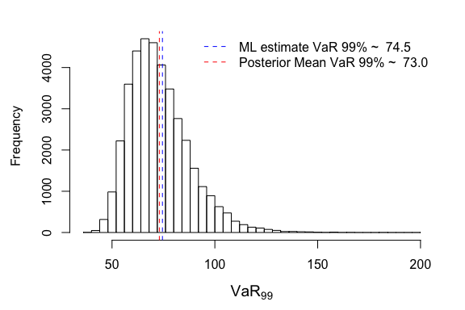
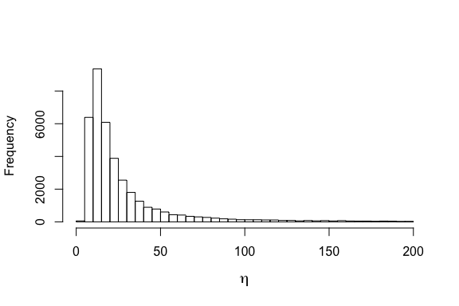
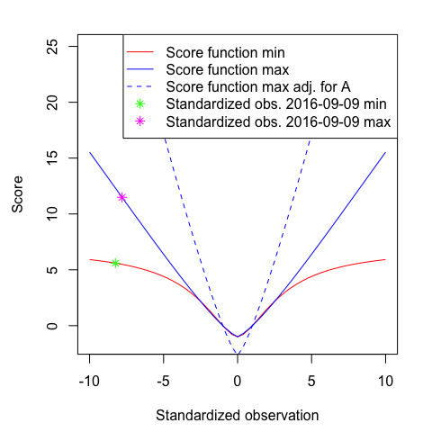

MCMC Method Comparisons: Beta-Gen-t-EGARCH
==========================================

This document contains the R code to reproduce the plots and statistical
analysis presented in section 4.1 of the thesis "Bayesian Inference for
Generalized Autoregressive Score Models".

    library(BayesianGAS)

    set.seed(100)
    kFiveYrsIdx <- 3769
    kNumParams  <- 6

Load data
---------

    data("SP500", package = "BayesianGAS")
    dates   <- as.Date(rev(spData$Date)[-(1:kFiveYrsIdx)])
    returns <- ts(
      diff(rev(spData$Adj.Close))[-(1:(kFiveYrsIdx - 1))],
      start = c(2012, 4, 16),
      frequency = 254
    )

### Plot Returns

    leg <- "S&P 500 Returns"
    par(mfrow = c(1, 1))
    plot(dates, returns, type = "l", xaxt = "n", xlab = "Years", ylab = "Return")
    legend("topleft", legend = leg, bty = "n", lty = 1)
    axis.Date(1, at = seq(min(dates), max(dates), by = "4 mon"), format = "%Y-%m")

### Set data attributes

    exKurt <- moments::kurtosis(returns) - 3
    # Based on student-t second and fourth order moments
    ltScale <- log(stats::sd(returns) * sqrt((6 / exKurt + 2) / (6 / exKurt + 4)))
    numObs <- length(returns)

Maximum Likelihood (ML) estimation
----------------------------------

    initParams  <- c(
      omega = ltScale,
      A = 0.05,
      B = 0.95,
      mu = mean(returns),
      etaBar = 0.2,
      upsilon = 2
    )
    startTime <- Sys.time()
    betaGen <- FitML(
      model = new(BetaGenTEGARCH),
      initParams = initParams,
      y = returns,
      f1 = ltScale,
      method = 'BFGS',
      control = list(maxit = 1e5),
      hessian = TRUE,
      verbose = TRUE
    )
    #> ML Log-Likelihood:  -5070.293 
    #> ML parameter estimates:  2.429966 0.09306954 0.9034235 1.151885 0.0371375 1.426176 
    #> ML standard errors:  0.05992938 0.01591343 0.02739745 0.3447871 0.04567477 0.1665972
    endTime <- Sys.time()
    timeML <- difftime(endTime, startTime, units = 'secs')
    cat("ML Time: ", timeML, sprintf(" seconds\n"))
    #> ML Time:  0.06885099  seconds

### Plot volatility

    betaGen$SetParams(betaGen$ParamsML)
    volsGen <- betaGen$VolFilter(returns, ltScale)
    par(mfrow = c(1, 1))
    plot.ts(cbind(abs(returns - betaGen$Mu), volsGen), col = c("black", "red"),
            lwd = c(1, 1.5), plot.type = "single", ylab = "Volatility")
    leg <- c(bquote(GAS - t ~ (logL = .(round(betaGen$LogLValML, 4)))))
    legend("topleft", legend = leg, lty = c(1), lwd = c(1.5), col = c("red"),
           bty = "n")

Markov Chain Monte Carlo (MCMC)
-------------------------------

    iter <- 4e4
    priorStack <- new(
      PriorStack,
      rep("ImproperUniform", kNumParams),
      list(
        c(-Inf, Inf),
        c(-Inf, Inf),
        c(-1, 1),
        c(-Inf, Inf),
        c(0, 0.5),
        c(0, Inf)
      )
    )

### Random Walk Metropolis Hastings (RWMH)

    startTime <- Sys.time()
    firstWarmUpRWMH <- RWMH(
      "BetaGenTEGARCH",
      priorStack,
      y = as.matrix(returns),
      f1 = ltScale,
      initParams = initParams,
      sigma = diag(kNumParams),
      iter = 100,
      stepsize = 0.01
    )
    #> RWMH - Accept ratio is: 0.590
    secondWarmUpRWMH <- RWMH(
      "BetaGenTEGARCH",
      priorStack,
      y = as.matrix(returns),
      f1 = ltScale,
      initParams = initParams,
      sigma = cov(firstWarmUpRWMH),
      iter = 1000,
      stepsize = 1
    )
    #> RWMH - Accept ratio is: 0.358
    drawsRWMH <- RWMH(
      "BetaGenTEGARCH",
      priorStack,
      y = as.matrix(returns),
      f1 = ltScale,
      initParams = initParams,
      sigma = cov(secondWarmUpRWMH),
      iter = iter,
      stepsize = 1
    )
    #> iter 1000
    #> iter 2000
    #> iter 3000
    #> iter 4000
    #> iter 5000
    #> iter 6000
    #> iter 7000
    #> iter 8000
    #> iter 9000
    #> iter 10000
    #> iter 11000
    #> iter 12000
    #> iter 13000
    #> iter 14000
    #> iter 15000
    #> iter 16000
    #> iter 17000
    #> iter 18000
    #> iter 19000
    #> iter 20000
    #> iter 21000
    #> iter 22000
    #> iter 23000
    #> iter 24000
    #> iter 25000
    #> iter 26000
    #> iter 27000
    #> iter 28000
    #> iter 29000
    #> iter 30000
    #> iter 31000
    #> iter 32000
    #> iter 33000
    #> iter 34000
    #> iter 35000
    #> iter 36000
    #> iter 37000
    #> iter 38000
    #> iter 39000
    #> RWMH - Accept ratio is: 0.189
    endTime <- Sys.time()
    timeRWMH <- difftime(endTime, startTime, units = 'secs')
    cat("RWMH Time: ", timeRWMH, sprintf(" seconds\n"))
    #> RWMH Time:  6.589134  seconds

### Adaptive Mixture of Student-t Distributions (AdMit)-MH

    logOffset <- 250 - betaGen$LogLValML # constant needed to prevent under/overflow
    startTime <- Sys.time()
    tries <- 0
    # AdMit Optimization occsianlly fails,
    # give it a few tries as randomness might be on your side.
    while (tries < 5) {
      possibleError <- tryCatch(
        outAdMit <- AdMit::AdMit(
          VectorizedPosterior,
          mu0 = initParams,
          control = list(df = 1, trace = TRUE),
          modelStr = "BetaGenTEGARCH",
          priorStack = priorStack,
          y = as.matrix(returns),
          f1 = ltScale,
          logOffset = logOffset
        ),
        error = function(e) e
      )

      if (!inherits(possibleError, "error")) {
        cat("AdMit tries: ", tries + 1, sprintf("\n"))
        break
      }else{
        tries <- tries + 1
        cat("ERROR: ", sprintf("\n"))
        print(possibleError)
      }
    }
    #>   H METHOD.mu TIME.mu METHOD.p TIME.p       CV
    #> 1 1      BFGS   0.076     NONE      0 1.525601
    #>   H METHOD.mu TIME.mu METHOD.p TIME.p       CV
    #> 1 2      BFGS   0.109   NLMINB  0.005 1.513234
    #> AdMit tries:  1
    if (tries == 5) {
      sprintf("AdMit optimization failed 5 times. Try different settings.")
    }

    betaGenAdMitMH <- AdMit::AdMitMH(
      N = iter,
      KERNEL = VectorizedPosterior,
      modelStr = "BetaGenTEGARCH",
      priorStack = priorStack,
      y = as.matrix(returns),
      f1 = ltScale,
      logOffset = logOffset,
      mit = outAdMit$mit
    )
    endTime <- Sys.time()
    timeAdMit <- difftime(endTime, startTime, units = 'secs')
    cat("AdMit-MH Time: ", timeAdMit, sprintf(" seconds\n"))
    #> AdMit-MH Time:  48.15493  seconds
    cat("AdMit-MH Accept Rate: ", betaGenAdMitMH$accept, sprintf("\n"))
    #> AdMit-MH Accept Rate:  0.28955

### Griddy Gibbs Sampler (GGS)

    numGridPoints <- 25
    lbParams <- apply(drawsRWMH, 2, function(x) {min(x) - 0.5 * stats::sd(x)})
    lbParams[5] <- max(1E-5, lbParams[5]) # lbEtab dilimited to 0
    ubParams <- apply(drawsRWMH, 2, function(x) {max(x) + 0.5 * stats::sd(x)})
    ubParams[5] <- min(0.5 - 1E-5, ubParams[5]) # ubEtab dilimited to 0.5
    ubParams[3] <- min(1 - 1E-5, ubParams[3])  # ubB to 1
    grid <- apply(
      cbind(lbParams, ubParams),
      1,
      function(x) {seq(x[1], x[2], length.out = numGridPoints)}
    )
    startTime <- Sys.time()
    drawsGGS <- GGS(
      "BetaGenTEGARCH",
      priorStack,
      y = as.matrix(returns),
      f1 = ltScale,
      initParams = initParams,
      grid = grid,
      iter = iter,
      logOffset = logOffset,
      printIter = 1000
    )
    #> iter 1000
    #> iter 2000
    #> iter 3000
    #> iter 4000
    #> iter 5000
    #> iter 6000
    #> iter 7000
    #> iter 8000
    #> iter 9000
    #> iter 10000
    #> iter 11000
    #> iter 12000
    #> iter 13000
    #> iter 14000
    #> iter 15000
    #> iter 16000
    #> iter 17000
    #> iter 18000
    #> iter 19000
    #> iter 20000
    #> iter 21000
    #> iter 22000
    #> iter 23000
    #> iter 24000
    #> iter 25000
    #> iter 26000
    #> iter 27000
    #> iter 28000
    #> iter 29000
    #> iter 30000
    #> iter 31000
    #> iter 32000
    #> iter 33000
    #> iter 34000
    #> iter 35000
    #> iter 36000
    #> iter 37000
    #> iter 38000
    #> iter 39000
    endTime <- Sys.time()
    timeGGS <- difftime(endTime, startTime, units = 'secs')
    cat("GGS Time: ", timeGGS, sprintf(" seconds\n"))
    #> GGS Time:  871.2423  seconds

### Hamiltonian Monte Carlo (HMC)

    lb = c(-Inf, -Inf, -1., -Inf, 0., 0.)
    ub = c(Inf, Inf, 1., Inf, 0.5, Inf)
    startTime <- Sys.time()
    firstWarmUpHMC <- HMC(
      "BetaGenTEGARCH",
      priorStack,
      y = as.matrix(returns),
      f1 = ltScale,
      initParams = initParams,
      iter = 100,
      mass = diag(kNumParams),
      stepsize = 0.01,
      integrationTime = 0.2,
      lb = lb,
      ub = ub
    )
    #> HMC - Accept ratio is: 0.890
    secondWarmUpHMC <- HMC(
      "BetaGenTEGARCH",
      priorStack,
      y = as.matrix(returns),
      f1 = ltScale,
      initParams = initParams,
      iter = 100,
      mass = solve(cov(firstWarmUpHMC[-(1:50),])),
      stepsize = 0.1,
      integrationTime = 2.,
      lb = lb,
      ub = ub
    )
    #> HMC - Accept ratio is: 0.920
    drawsHMC <- HMC(
      "BetaGenTEGARCH",
      priorStack,
      y = as.matrix(returns),
      f1 = ltScale,
      initParams = initParams,
      iter = iter,
      mass = solve(cov(secondWarmUpHMC[-(1:20),])),
      stepsize = 0.5,
      integrationTime = 2.0,
      lb = lb,
      ub = ub
    )
    #> iter 1000
    #> iter 2000
    #> iter 3000
    #> iter 4000
    #> iter 5000
    #> iter 6000
    #> iter 7000
    #> iter 8000
    #> iter 9000
    #> iter 10000
    #> iter 11000
    #> iter 12000
    #> iter 13000
    #> iter 14000
    #> iter 15000
    #> iter 16000
    #> iter 17000
    #> iter 18000
    #> iter 19000
    #> iter 20000
    #> iter 21000
    #> iter 22000
    #> iter 23000
    #> iter 24000
    #> iter 25000
    #> iter 26000
    #> iter 27000
    #> iter 28000
    #> iter 29000
    #> iter 30000
    #> iter 31000
    #> iter 32000
    #> iter 33000
    #> iter 34000
    #> iter 35000
    #> iter 36000
    #> iter 37000
    #> iter 38000
    #> iter 39000
    #> HMC - Accept ratio is: 0.845
    endTime <- Sys.time()
    timeHMC <- difftime(endTime, startTime, units = 'secs')
    cat("HMC Time: ", timeHMC, sprintf(" seconds\n"))
    #> HMC Time:  82.19355  seconds

Comparing MCMC Methods
----------------------

    mcmcNames <- c("RWMH", "Griddy Gibbs", "AdMit", "HMC")
    N <- kNumParams * length(mcmcNames)
    parNames <- list(
      expression(tilde(omega)),
      "A",
      "B",
      expression(mu),
      expression(bar(eta)),
      expression(upsilon)
    )
    # First draw is weird, should be ignored
    betaGenAdMitMH$draws[1,] <- betaGenAdMitMH$draws[2,]
    samples <- matrix(cbind(drawsRWMH, drawsGGS, betaGenAdMitMH$draws, drawsHMC),
                      iter, N)
    colNames <- c()
    for (mcmcName in mcmcNames) {
      for (parName in parNames) {
        colNames <- c(colNames, paste(mcmcName, parName, sep = " "))
      }
    }
    colnames(samples) <- colNames
    burn <- 1000

### Convergence

    mcmcSamples <- coda::mcmc(samples, start = burn, end = iter)
    GC.diagnostic <- coda::geweke.diag(mcmcSamples, 0.1, 0.5)
    zVals <- matrix(GC.diagnostic$z, ncol = kNumParams, byrow = TRUE)
    zVals <- data.frame(zVals, row.names = mcmcNames)
    colnames(zVals) <- c("OmegaTilde", "A", "B", "Mu", "EtaBar", "Upsilon")
    knitr::kable(zVals, caption = "Geweke convergence diagnostics")

<table>
<caption>Geweke convergence diagnostics</caption>
<thead>
<tr class="header">
<th></th>
<th align="right">OmegaTilde</th>
<th align="right">A</th>
<th align="right">B</th>
<th align="right">Mu</th>
<th align="right">EtaBar</th>
<th align="right">Upsilon</th>
</tr>
</thead>
<tbody>
<tr class="odd">
<td>RWMH</td>
<td align="right">1.2140317</td>
<td align="right">0.7266753</td>
<td align="right">-0.5807722</td>
<td align="right">1.1001550</td>
<td align="right">-0.6168531</td>
<td align="right">-0.2757543</td>
</tr>
<tr class="even">
<td>Griddy Gibbs</td>
<td align="right">-0.6298305</td>
<td align="right">-2.3906994</td>
<td align="right">0.9140195</td>
<td align="right">1.3496958</td>
<td align="right">0.8844670</td>
<td align="right">1.2720085</td>
</tr>
<tr class="odd">
<td>AdMit</td>
<td align="right">1.0010416</td>
<td align="right">-0.6272574</td>
<td align="right">0.3755040</td>
<td align="right">-0.8496122</td>
<td align="right">0.5592733</td>
<td align="right">0.9532968</td>
</tr>
<tr class="even">
<td>HMC</td>
<td align="right">-0.3863332</td>
<td align="right">-0.0470370</td>
<td align="right">-0.5610352</td>
<td align="right">-0.4676416</td>
<td align="right">0.0778575</td>
<td align="right">-0.3850174</td>
</tr>
</tbody>
</table>

    knitr::kable(abs(zVals) < 1.96, caption = "Geweke convergence diagnostics test @ 5% significance")

<table>
<caption>Geweke convergence diagnostics test @ 5% significance</caption>
<thead>
<tr class="header">
<th></th>
<th align="left">OmegaTilde</th>
<th align="left">A</th>
<th align="left">B</th>
<th align="left">Mu</th>
<th align="left">EtaBar</th>
<th align="left">Upsilon</th>
</tr>
</thead>
<tbody>
<tr class="odd">
<td>RWMH</td>
<td align="left">TRUE</td>
<td align="left">TRUE</td>
<td align="left">TRUE</td>
<td align="left">TRUE</td>
<td align="left">TRUE</td>
<td align="left">TRUE</td>
</tr>
<tr class="even">
<td>Griddy Gibbs</td>
<td align="left">TRUE</td>
<td align="left">FALSE</td>
<td align="left">TRUE</td>
<td align="left">TRUE</td>
<td align="left">TRUE</td>
<td align="left">TRUE</td>
</tr>
<tr class="odd">
<td>AdMit</td>
<td align="left">TRUE</td>
<td align="left">TRUE</td>
<td align="left">TRUE</td>
<td align="left">TRUE</td>
<td align="left">TRUE</td>
<td align="left">TRUE</td>
</tr>
<tr class="even">
<td>HMC</td>
<td align="left">TRUE</td>
<td align="left">TRUE</td>
<td align="left">TRUE</td>
<td align="left">TRUE</td>
<td align="left">TRUE</td>
<td align="left">TRUE</td>
</tr>
</tbody>
</table>

### Descriptic statistics of MCMC draws

    knitr::kable(summary(mcmcSamples)$statistics)

<table>
<thead>
<tr class="header">
<th></th>
<th align="right">Mean</th>
<th align="right">SD</th>
<th align="right">Naive SE</th>
<th align="right">Time-series SE</th>
</tr>
</thead>
<tbody>
<tr class="odd">
<td>RWMH tilde(omega)</td>
<td align="right">2.4293104</td>
<td align="right">0.0624843</td>
<td align="right">0.0003164</td>
<td align="right">0.0019057</td>
</tr>
<tr class="even">
<td>RWMH A</td>
<td align="right">0.0974758</td>
<td align="right">0.0161832</td>
<td align="right">0.0000819</td>
<td align="right">0.0004161</td>
</tr>
<tr class="odd">
<td>RWMH B</td>
<td align="right">0.9004333</td>
<td align="right">0.0282748</td>
<td align="right">0.0001432</td>
<td align="right">0.0007649</td>
</tr>
<tr class="even">
<td>RWMH mu</td>
<td align="right">1.2005756</td>
<td align="right">0.3072029</td>
<td align="right">0.0015556</td>
<td align="right">0.0335892</td>
</tr>
<tr class="odd">
<td>RWMH bar(eta)</td>
<td align="right">0.0640917</td>
<td align="right">0.0384193</td>
<td align="right">0.0001945</td>
<td align="right">0.0012813</td>
</tr>
<tr class="even">
<td>RWMH upsilon</td>
<td align="right">1.5127865</td>
<td align="right">0.1582050</td>
<td align="right">0.0008011</td>
<td align="right">0.0065048</td>
</tr>
<tr class="odd">
<td>Griddy Gibbs tilde(omega)</td>
<td align="right">2.4286597</td>
<td align="right">0.0660522</td>
<td align="right">0.0003345</td>
<td align="right">0.0003929</td>
</tr>
<tr class="even">
<td>Griddy Gibbs A</td>
<td align="right">0.0977956</td>
<td align="right">0.0171181</td>
<td align="right">0.0000867</td>
<td align="right">0.0001177</td>
</tr>
<tr class="odd">
<td>Griddy Gibbs B</td>
<td align="right">0.8998182</td>
<td align="right">0.0300956</td>
<td align="right">0.0001524</td>
<td align="right">0.0002020</td>
</tr>
<tr class="even">
<td>Griddy Gibbs mu</td>
<td align="right">1.1883048</td>
<td align="right">0.3336099</td>
<td align="right">0.0016893</td>
<td align="right">0.0019043</td>
</tr>
<tr class="odd">
<td>Griddy Gibbs bar(eta)</td>
<td align="right">0.0635389</td>
<td align="right">0.0401990</td>
<td align="right">0.0002036</td>
<td align="right">0.0005266</td>
</tr>
<tr class="even">
<td>Griddy Gibbs upsilon</td>
<td align="right">1.5082381</td>
<td align="right">0.1652578</td>
<td align="right">0.0008368</td>
<td align="right">0.0021135</td>
</tr>
<tr class="odd">
<td>AdMit tilde(omega)</td>
<td align="right">2.4294690</td>
<td align="right">0.0627902</td>
<td align="right">0.0003179</td>
<td align="right">0.0008203</td>
</tr>
<tr class="even">
<td>AdMit A</td>
<td align="right">0.0982536</td>
<td align="right">0.0165592</td>
<td align="right">0.0000838</td>
<td align="right">0.0002135</td>
</tr>
<tr class="odd">
<td>AdMit B</td>
<td align="right">0.8992968</td>
<td align="right">0.0291942</td>
<td align="right">0.0001478</td>
<td align="right">0.0004279</td>
</tr>
<tr class="even">
<td>AdMit mu</td>
<td align="right">1.1881221</td>
<td align="right">0.3284495</td>
<td align="right">0.0016631</td>
<td align="right">0.0040546</td>
</tr>
<tr class="odd">
<td>AdMit bar(eta)</td>
<td align="right">0.0625266</td>
<td align="right">0.0387768</td>
<td align="right">0.0001964</td>
<td align="right">0.0005167</td>
</tr>
<tr class="even">
<td>AdMit upsilon</td>
<td align="right">1.5041599</td>
<td align="right">0.1567197</td>
<td align="right">0.0007936</td>
<td align="right">0.0020784</td>
</tr>
<tr class="odd">
<td>HMC tilde(omega)</td>
<td align="right">2.4299069</td>
<td align="right">0.0626363</td>
<td align="right">0.0003172</td>
<td align="right">0.0003866</td>
</tr>
<tr class="even">
<td>HMC A</td>
<td align="right">0.0977870</td>
<td align="right">0.0163549</td>
<td align="right">0.0000828</td>
<td align="right">0.0000837</td>
</tr>
<tr class="odd">
<td>HMC B</td>
<td align="right">0.8989737</td>
<td align="right">0.0293885</td>
<td align="right">0.0001488</td>
<td align="right">0.0001580</td>
</tr>
<tr class="even">
<td>HMC mu</td>
<td align="right">1.1840802</td>
<td align="right">0.3285655</td>
<td align="right">0.0016637</td>
<td align="right">0.0015568</td>
</tr>
<tr class="odd">
<td>HMC bar(eta)</td>
<td align="right">0.0612384</td>
<td align="right">0.0390431</td>
<td align="right">0.0001977</td>
<td align="right">0.0002636</td>
</tr>
<tr class="even">
<td>HMC upsilon</td>
<td align="right">1.5002221</td>
<td align="right">0.1590873</td>
<td align="right">0.0008056</td>
<td align="right">0.0010590</td>
</tr>
</tbody>
</table>

### Effective sample sizes (ESSs) & factors

    timesMcmc <- c(timeRWMH, timeGGS, timeAdMit, timeHMC)
    ESSs <- coda::effectiveSize(mcmcSamples)
    ESSs <- matrix(ESSs, ncol = kNumParams, byrow = TRUE)
    ESSs <- data.frame(ESSs, row.names = mcmcNames)
    colnames(ESSs) <- c("OmegaTilde", "A", "B", "Mu", "EtaBar", "Upsilon")
    knitr::kable(ESSs, caption = "Effective sample sizes")

<table>
<caption>Effective sample sizes</caption>
<thead>
<tr class="header">
<th></th>
<th align="right">OmegaTilde</th>
<th align="right">A</th>
<th align="right">B</th>
<th align="right">Mu</th>
<th align="right">EtaBar</th>
<th align="right">Upsilon</th>
</tr>
</thead>
<tbody>
<tr class="odd">
<td>RWMH</td>
<td align="right">1075.037</td>
<td align="right">1512.480</td>
<td align="right">1366.282</td>
<td align="right">83.64741</td>
<td align="right">899.1006</td>
<td align="right">591.5322</td>
</tr>
<tr class="even">
<td>Griddy Gibbs</td>
<td align="right">28263.239</td>
<td align="right">21165.976</td>
<td align="right">22193.256</td>
<td align="right">30689.41387</td>
<td align="right">5828.3889</td>
<td align="right">6113.9934</td>
</tr>
<tr class="odd">
<td>AdMit</td>
<td align="right">5859.285</td>
<td align="right">6013.528</td>
<td align="right">4655.760</td>
<td align="right">6562.08073</td>
<td align="right">5631.0468</td>
<td align="right">5685.9882</td>
</tr>
<tr class="even">
<td>HMC</td>
<td align="right">26243.852</td>
<td align="right">38166.549</td>
<td align="right">34595.314</td>
<td align="right">44545.04102</td>
<td align="right">21940.3265</td>
<td align="right">22565.9282</td>
</tr>
</tbody>
</table>

    knitr::kable(ESSs / as.numeric(timesMcmc), caption = "Effective sample sizes per second")

<table>
<caption>Effective sample sizes per second</caption>
<thead>
<tr class="header">
<th></th>
<th align="right">OmegaTilde</th>
<th align="right">A</th>
<th align="right">B</th>
<th align="right">Mu</th>
<th align="right">EtaBar</th>
<th align="right">Upsilon</th>
</tr>
</thead>
<tbody>
<tr class="odd">
<td>RWMH</td>
<td align="right">163.15295</td>
<td align="right">229.54161</td>
<td align="right">207.35383</td>
<td align="right">12.69475</td>
<td align="right">136.452014</td>
<td align="right">89.773893</td>
</tr>
<tr class="even">
<td>Griddy Gibbs</td>
<td align="right">32.44016</td>
<td align="right">24.29402</td>
<td align="right">25.47312</td>
<td align="right">35.22489</td>
<td align="right">6.689745</td>
<td align="right">7.017558</td>
</tr>
<tr class="odd">
<td>AdMit</td>
<td align="right">121.67569</td>
<td align="right">124.87876</td>
<td align="right">96.68294</td>
<td align="right">136.27017</td>
<td align="right">116.936037</td>
<td align="right">118.076966</td>
</tr>
<tr class="even">
<td>HMC</td>
<td align="right">319.29334</td>
<td align="right">464.34971</td>
<td align="right">420.90062</td>
<td align="right">541.95303</td>
<td align="right">266.934910</td>
<td align="right">274.546233</td>
</tr>
</tbody>
</table>

### Trace plots

    PlotTraces(
      samples,
      mcmcNames[-1],
      parNames = list("B", expression(bar(eta))),
      iters = (10000:10500),
      cols = c(2, 4)
    )

### Histograms

    PlotHists(
      samples,
      mcmcNames[-1],
      parNames = list("B", expression(bar(eta)), expression(upsilon)),
      burn = burn
    )

### Joint distribtuion plots

    paramPairs <- list(
      list(expression(tilde(omega)), "B"),
      list("A", "B"),
      list(expression(omega), "B"),
      list(expression(bar(eta)), expression(upsilon))
    )
    colnames(drawsHMC) <- parNames
    names(lbParams) <- parNames
    names(ubParams) <- parNames
    omegaDrawsHMC <- drawsHMC[,paste(parNames[1])] * (1 - drawsHMC[,"B"])
    drawsHMC_ <- cbind(drawsHMC, "expression(omega)" = omegaDrawsHMC)
    lbParams_ <- c(lbParams, "expression(omega)" = 0.0)
    ubParams_ <- c(ubParams, "expression(omega)" = 0.85)
    PlotJointDists(drawsHMC_, paramPairs, lbParams_, ubParams_, burn = burn)

### Auto Correlation Function (ACF) plots

    PlotACFs(
      samples,
      mcmcNames[-1],
      parNames = list("B", expression(bar(eta))),
      burn = burn
    )

Posterior of volatility
-----------------------

    volsGenDraws <- matrix(0, iter - burn, length(returns))
    for (i in 1:(iter - burn)) {
      betaGen$SetParams(as.vector(drawsHMC[burn + i,]))
      volsGenDraws[i, ] <- betaGen$VolFilter(returns, ltScale)
      if ((i > 0) && ((i %% 1e4) == 0)) {
        cat(sprintf("iter %i\n", i));
      }
    }
    #> iter 10000
    #> iter 20000
    #> iter 30000
    # Draws for which EtaBar is close to zero will result in under/overflow issues
    # in the gamma function. This is corrected for by calculating vols for these
    # draws using the limiting GED volatility formula.
    zeroix <- which(
      apply(volsGenDraws, 1, function(x) any(x == 0)) |
      apply(volsGenDraws, 1, function(x) any(is.na(x)))
    )
    for (i in zeroix) {
      betaGen$SetParams(drawsHMC[burn + i,])
      scale <- betaGen$Filter(returns, ltScale)
      volsGenDraws[i, ] <- (
        exp(scale) * (betaGen$Upsilon ^ (1 / betaGen$Upsilon)) *
        sqrt(gamma(3 / betaGen$Upsilon) /  gamma(1 / betaGen$Upsilon))
      )
    }

### Highest Posterior Density (HPD) volatility plots

    zoomDate <- "2016-09-12"
    PlotHPDOverTime(
      volsGenDraws,
      returns,
      dates,
      startDate = "2016-04-21",
      endDate = "2017-04-21",
      ylab = "Returns",
      statStr = "volatility",
      obsStr = "S&P 500 absolute returns",
      statsML = volsGen,
      zoomDate = zoomDate,
      xy1 = list(x = c(17058, 17165), y = c(39.5, 102)),
      xy2 = list(x = c(17058, 17165), y = c(18, 55))
    )

### Some posterior statistics of volatility

    zoomDateIdx <- which(dates == as.Date(zoomDate))
    zoomDateDraws <- volsGenDraws[, zoomDateIdx]

Return the day before 2016-09-12: -53.48999  
Mean skewness whole sample: 0.2231932  
Mean kurtosis whole sample: 3.1708736  
Mean skewness on 2016-09-12: 1.0379262  
Mean kurtosis on 2016-09-12: 4.853181

Beta-t-EGARCH comparison
------------------------

### ML estimation Beta-t-EGARCH

    initParamsBetaT  <- c(
      omega = ltScale,
      A = 0.05,
      B = 0.95,
      mu = mean(returns),
      NuBar = 0.2
    )
    betaT <- FitML(
      model = new(BetaTEGARCH),
      initParams = initParamsBetaT,
      y = returns,
      f1 = ltScale,
      method = 'BFGS',
      control = list(maxit = 1e5),
      hessian = TRUE,
      verbose = TRUE
    )
    #> ML Log-Likelihood:  -5074.157 
    #> ML parameter estimates:  2.446695 0.09074957 0.9097673 1.357674 0.1501465 
    #> ML standard errors:  0.06176629 0.01471788 0.02568796 0.3305722 0.02745212
    betaT$SetParams(betaT$ParamsML)
    volsT <- betaT$VolFilter(returns, ltScale)

### HMC Beta-t-EGARCH

    kNumParamsBetaT <- 5
    priorStackBetaT <- new(
      PriorStack,
      rep("ImproperUniform", kNumParamsBetaT),
      list(
        c(-Inf, Inf),
        c(-Inf, Inf),
        c(-1, 1),
        c(-Inf, Inf),
        c(0, 0.5)
      )
    )
    lbBetaT = c(-Inf, -Inf, -1., -Inf, 0.)
    ubBetaT = c(Inf, Inf, 1., Inf, 0.5)
    startTime <- Sys.time()
    firstWarmUpHMCBetaT <- HMC(
      "BetaTEGARCH",
      priorStackBetaT,
      y = as.matrix(returns),
      f1 = ltScale,
      initParams = initParamsBetaT,
      iter = 100,
      mass = diag(kNumParamsBetaT),
      stepsize = 0.01,
      integrationTime = 0.2,
      lb = lbBetaT,
      ub = ubBetaT
    )
    #> HMC - Accept ratio is: 0.970
    secondWarmUpHMCBetaT <- HMC(
      "BetaTEGARCH",
      priorStackBetaT,
      y = as.matrix(returns),
      f1 = ltScale,
      initParams = initParamsBetaT,
      iter = 100,
      mass = solve(cov(firstWarmUpHMCBetaT[-(1:50),])),
      stepsize = 0.1,
      integrationTime = 2.,
      lb = lbBetaT,
      ub = ubBetaT
    )
    #> HMC - Accept ratio is: 0.990
    drawsHMCBetaT <- HMC(
      "BetaTEGARCH",
      priorStackBetaT,
      y = as.matrix(returns),
      f1 = ltScale,
      initParams = initParamsBetaT,
      iter = iter,
      mass = solve(cov(secondWarmUpHMCBetaT[-(1:20),])),
      stepsize = 0.5,
      integrationTime = 2.0,
      lb = lbBetaT,
      ub = ubBetaT
    )
    #> iter 1000
    #> iter 2000
    #> iter 3000
    #> iter 4000
    #> iter 5000
    #> iter 6000
    #> iter 7000
    #> iter 8000
    #> iter 9000
    #> iter 10000
    #> iter 11000
    #> iter 12000
    #> iter 13000
    #> iter 14000
    #> iter 15000
    #> iter 16000
    #> iter 17000
    #> iter 18000
    #> iter 19000
    #> iter 20000
    #> iter 21000
    #> iter 22000
    #> iter 23000
    #> iter 24000
    #> iter 25000
    #> iter 26000
    #> iter 27000
    #> iter 28000
    #> iter 29000
    #> iter 30000
    #> iter 31000
    #> iter 32000
    #> iter 33000
    #> iter 34000
    #> iter 35000
    #> iter 36000
    #> iter 37000
    #> iter 38000
    #> iter 39000
    #> HMC - Accept ratio is: 0.962
    endTime <- Sys.time()
    timeHMCBetaT <- difftime(endTime, startTime, units = 'secs')
    cat("HMC Time: ", timeHMCBetaT, sprintf(" seconds\n"))
    #> HMC Time:  46.40304  seconds

### Posterior of volatility Beta-t-EGARCH

    volsTDraws <- matrix(0, iter - burn, length(returns))
    for (i in 1:(iter - burn)) {
      betaT$SetParams(as.vector(drawsHMCBetaT[burn + i,]))
      volsTDraws[i, ] <- betaT$VolFilter(returns, ltScale)
      if ((i > 0) && ((i %% 1e4) == 0)) {
        cat(sprintf("iter %i\n", i));
      }
    }
    #> iter 10000
    #> iter 20000
    #> iter 30000

### HPD volatility plots Beta-t-EGARCH

    zoomDate <- "2016-09-12"
    PlotHPDOverTime(
      volsTDraws,
      returns,
      dates,
      startDate = "2016-04-21",
      endDate = "2017-04-21",
      ylab = "Returns",
      statStr = "volatility",
      obsStr = "S&P 500 absolute returns",
      statsML = volsT,
      zoomDate = zoomDate,
      xy1 = list(x = c(17058, 17165), y = c(26, 102)),
      xy2 = list(x = c(17058, 17165), y = c(18, 55)),
      modeCol = rgb(0,0,1,1), 
      MLCol = "red", 
      fillCol = rgb(0,0,1,1/4),
      borderCol = rgb(0,0,1,1/2)
    )

Miscelaneuos
------------

### Value at Risk (VaR) histogram

    VaRBetaGenTEGARCH <- function(params, vols, muIdx, etaBIdx, upsIdx, alpha=0.99){
      if (is.matrix(params)) {
        mu <- params[, muIdx]
        etaB <- params[, etaBIdx]
        ups <- params[, upsIdx]
      }else{
        mu <- params[muIdx]
        etaB <- params[etaBIdx]
        ups <- params[upsIdx]
      }

      xt <- qbeta(2 * (1 - alpha), 1 / (etaB * ups), 1 / ups)
      Finvxt <- (((1 - xt) / (etaB * xt)) ^ (1 / ups))
      if (is.matrix(vols)) {
        numDraws <- dim(vols)[1]
        numObs <- dim(vols)[2]
        VaR <- matrix(0, numDraws, numObs)
        for (i in 1:numObs) {
          VaR[, i] <- mu + vols[, i] * Finvxt
        }
      }else{
        VaR <- mu + vols * Finvxt
      }
      return(VaR)
    }
    VaR99 <- VaRBetaGenTEGARCH(
      drawsHMC[-(1:burn),],
      volsGenDraws,
      "expression(mu)",
      "expression(bar(eta))",
      "expression(upsilon)",
      alpha = 0.99
    )
    VaR99ML <- VaRBetaGenTEGARCH(betaGen$ParamsML, volsGen, 4, 5, 6, alpha = 0.99)
    par(mfrow = c(1, 1), mar = c(4.5, 4.5, 2, 2))
    h <- hist(VaR99[, zoomDateIdx], breaks = 9:50 * 4, plot = FALSE)
    plot(h, main = "", xlab = "")
    title(xlab = expression(VaR[99]), cex.lab = 1.2)
    abline(v = VaR99ML[zoomDateIdx], lty = 2, col = "blue")
    abline(v = mean(VaR99[, zoomDateIdx]), lty = 2, col = "red")
    leg <- c(
      paste("ML estimate VaR 99% ~ ", sprintf("%.1f", VaR99ML[zoomDateIdx])),
      paste("Posterior Mean VaR 99% ~ ", sprintf("%.1f", mean(VaR99[,zoomDateIdx])))
    )
    legend("topright", legend = leg, bty = "n", col = c("blue", "red"), 
           lty = c(2, 2))

### Degrees of freedom parameter histogram

    drawsEta <- 1 / drawsHMC[-(1:burn), "expression(bar(eta))"]
    cat("Posterior range d.o.f. parameter Beta-Gen-t-EGARCH: ", range(drawsEta), 
        sprintf("\n"))
    #> Posterior range d.o.f. parameter Beta-Gen-t-EGARCH:  3.33558 1123265
    cat("Posterior range d.o.f. parameter Beta-t-EGARCH: ", 
        range(1 / drawsHMCBetaT[,5]), sprintf("\n"))
    #> Posterior range d.o.f. parameter Beta-t-EGARCH:  3.302752 16.99341
    hist(main = "", drawsEta[drawsEta < 200], xlab = "", breaks = 0:40 * 5)
    title(xlab = expression(eta), cex.lab = 1.2)

### Score function plots

    scoreGenT <- function(etaBar, upsilon, residual){
      b <- (etaBar * (abs(residual) ^ upsilon) /
              (etaBar * (abs(residual) ^ upsilon) + 1))
      return(((etaBar + 1) / etaBar) * b - 1)
    }
    scoreGED <- function(upsilon, residual){
      return((abs(residual) ^ upsilon) - 1)
    }
    drawsA <- drawsHMC[-(1:burn), "A"]
    drawsMu <- drawsHMC[-(1:burn), "expression(mu)"]
    drawsEtaB <- drawsHMC[-(1:burn), "expression(bar(eta))"]
    drawsUps <- drawsHMC[-(1:burn), "expression(upsilon)"]
    par(mfrow = c(1, 1), mar = c(4.5, 4.5, 2, 2))
    ixMin <- which.min(volsGenDraws[, zoomDateIdx])
    ixMax <- which.max(volsGenDraws[, zoomDateIdx])
    fGenDraws <- matrix(0, iter - burn, length(returns))
    for (i in 1:(iter - burn)) {
      betaGen$SetParams(as.vector(drawsHMC[burn + i,]))
      fGenDraws[i, ] <- betaGen$Filter(returns, ltScale)
      if ((i > 0) && ((i %% 1e4) == 0)) {
        cat(sprintf("iter %i\n", i));
      }
    }
    #> iter 10000
    #> iter 20000
    #> iter 30000
    epsMin <- (exp(-fGenDraws[, zoomDateIdx - 1][ixMin]) *
                 (returns[zoomDateIdx - 1] - drawsMu[ixMin]))
    epsMax <- (exp(-fGenDraws[, zoomDateIdx - 1][ixMax]) *
                 (returns[zoomDateIdx - 1] - drawsMu[ixMax]))
    xVals <- -25:25 / 2.5
    scoreGenMin <- scoreGenT(drawsEtaB[ixMin], drawsUps[ixMin], xVals)
    scoreGenMax <- scoreGenT(drawsEtaB[ixMax], drawsUps[ixMax], xVals)
    scoreGenMaxAdj <- (scoreGenT(drawsEtaB[ixMax], drawsUps[ixMax], xVals) *
                         drawsA[ixMax] / drawsA[ixMin])
    scoreGenEpsMin <- scoreGenT(drawsEtaB[ixMin], drawsUps[ixMin], epsMin)
    scoreGenEpsMax <- scoreGenT(drawsEtaB[ixMax], drawsUps[ixMax], epsMax)
    scoreGenEpsMaxAdj <- (scoreGenT(drawsEtaB[ixMax], drawsUps[ixMax], epsMax) *
                         drawsA[ixMax] / drawsA[ixMin])
    plot(
      xVals,
      scoreGenMin,
      ylab = "Score",
      xlab = "Standardized observation",
      col = "red",
      type = "l",
      ylim = c(-1.5, 25)
    )
    lines(xVals, scoreGenMax, col = "blue")
    lines(xVals, scoreGenMaxAdj, col = "blue", lty = 2)
    points(epsMin, scoreGenEpsMin, col = "green", pch = 8)
    points(epsMax, scoreGenEpsMax, col = "magenta", pch = 8)
    points(epsMax, scoreGenEpsMaxAdj, col = "magenta", pch = 8)
    leg <-
      c(
        "Score function min",
        "Score function max",
        "Score function max adj. for A",
        "Standardized obs. 2016-09-09 min",
        "Standardized obs. 2016-09-09 max"
      )
    legend(
      "topright",
      legend = leg,
      col = c("red", "blue", "blue", "green", "magenta"),
      lty = c(1, 1, 2, NA, NA),
      pch = c(NA, NA, NA, 8, 8)
    )
    par(mfrow = c(1, 1), mar = c(4.5, 2, 2, 2))
    plot(xVals, scoreGenT(0.2, 2, xVals), col = "red", type = "l",
         ylim = c(-1.5, 10), xlab = "Standardized observation")
    lines(xVals, scoreGED(1, xVals), col = "blue")
    lines(xVals, scoreGED(1.5, xVals), col = "green")
    leg <- c("Student-t, 5 d.o.f.", "Laplace", "Gaussian")
    legend("topright", legend = leg, col = c("red", "blue", "green"), 
           lty = c(1, 1, 1))

