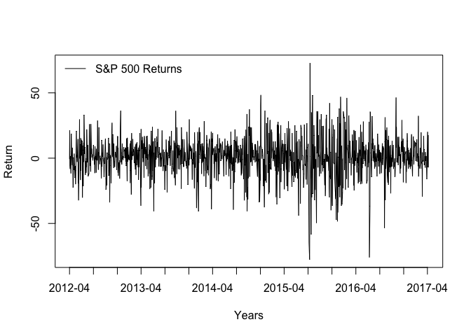
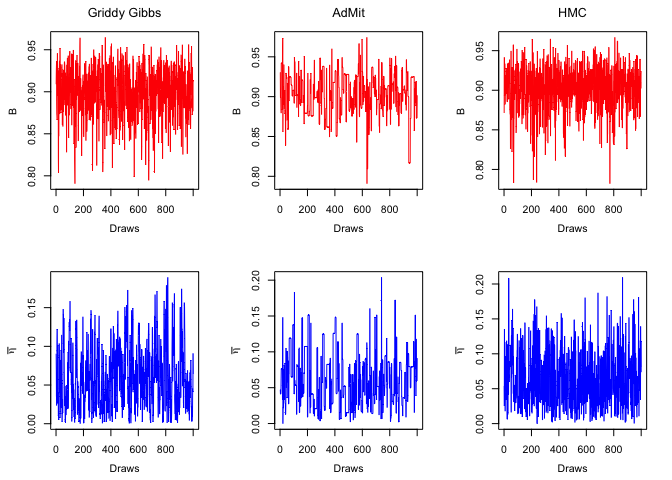
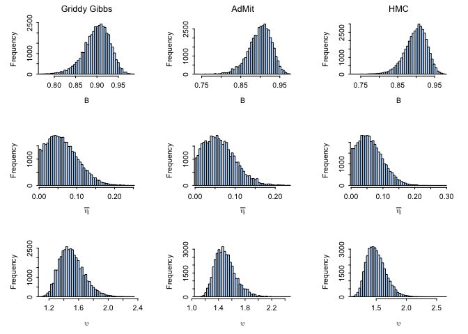
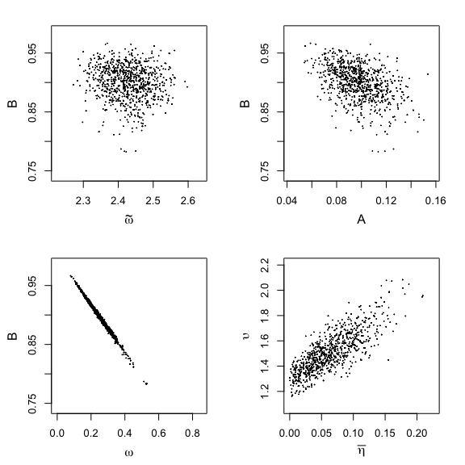
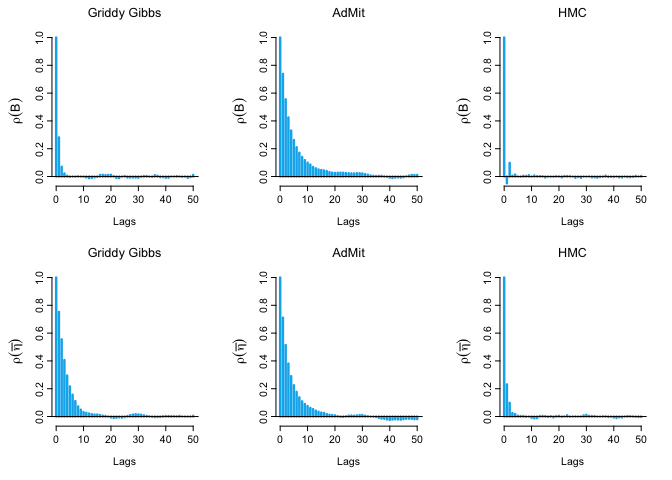
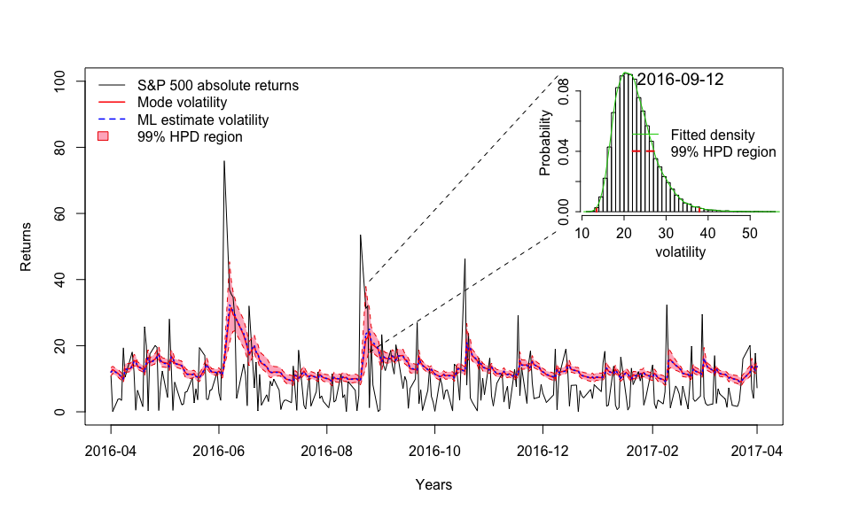
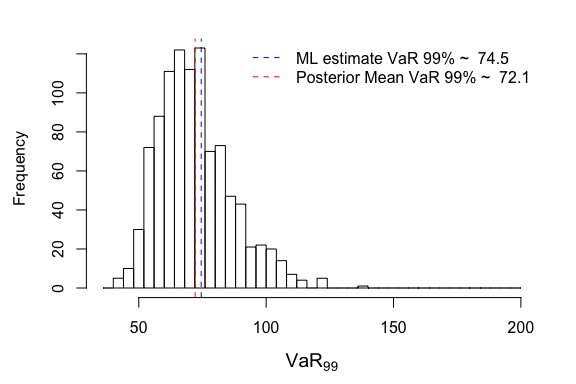
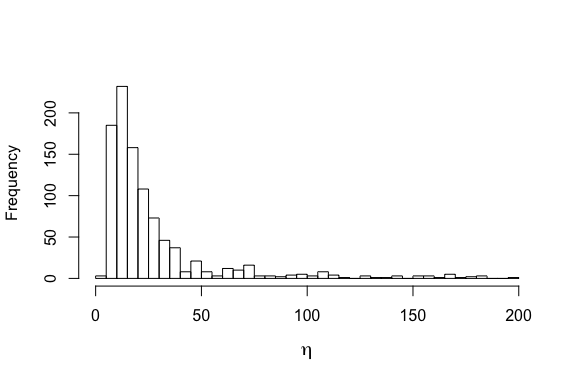
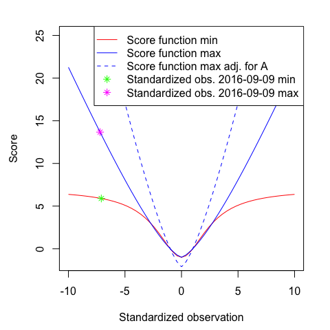
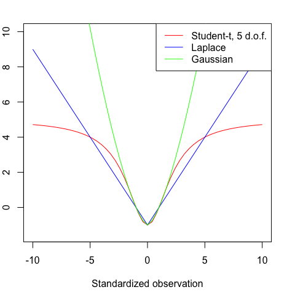

MCMC Method Comparisons: Beta-Gen-t-EGARCH
==========================================

This document contains the R code to reproduce the plots and statistical
analysis presented in section 4.1 of &gt; Niesert, R. "Bayesian
Inference for Generalized Autoregressive Score Models." (2017).

    library(BayesianGAS)

    set.seed(100)
    kFiveYrsIdx <- 3769
    kNumParams  <- 6

Load data
---------

    data(SP500, package = "BayesianGAS")
    times   <- as.Date(rev(spData$Date)[-(1:kFiveYrsIdx)])
    returns <- ts(
      diff(rev(spData$Adj.Close))[-(1:(kFiveYrsIdx - 1))],
      start = c(2012, 4, 16),
      frequency = 254
    )

### Plot Returns

    leg = "S&P 500 Returns"
    par(mfrow = c(1, 1))
    plot(times, returns, type = "l", xaxt = "n", xlab = "Years", ylab = "Return")
    legend("topleft", legend = leg, bty = "n", lty = 1)
    axis.Date(1, at = seq(min(times), max(times), by = "4 mon"), format = "%Y-%m")

### Set data attributes

    exKurt <- moments::kurtosis(returns) - 3
    # Based on student-t second and fourth order moments
    ltScale <- log(sd(returns) * sqrt((6 / exKurt + 2) / (6 / exKurt + 4)))
    numObs <- length(returns)

Maximum Likelihood (ML) estimation
----------------------------------

    initParams  <- c(
      omega = ltScale,
      A = 0.05,
      B = 0.95,
      mu = mean(returns),
      etaBar = 0.2,
      upsilon = 2
    )
    startTime <- Sys.time()
    betaGen <- FitML(
      model = new(BetaGenTEGARCH),
      initParams = initParams,
      y = returns,
      f1 = ltScale,
      method = 'BFGS',
      control = list(maxit = 1e5),
      hessian = TRUE,
      verbose = TRUE
    )
    #> ML Log-Likelihood:  -5070.293 
    #> ML parameter estimates:  2.429966 0.09306954 0.9034235 1.151885 0.0371375 1.426176 
    #> ML standard errors:  2.429966 0.09306954 0.9034235 1.151885 0.0371375 1.426176
    endTime <- Sys.time()
    timeML <- difftime(endTime, startTime, units = 'secs')
    cat("ML Time: ", timeML, sprintf(" seconds\n"))
    #> ML Time:  0.05789995  seconds

### Plot volatility

    betaGen$SetParams(betaGen$ParamsML)
    volsGen <- betaGen$VolFilter(returns, ltScale)
    par(mfrow = c(1, 1))
    plot.ts(cbind(abs(returns - betaGen$Mu), volsGen), col = c("black", "red"),
            lwd = c(1, 1.5), plot.type = "single", ylab = "Volatility")
    leg <- c(bquote(GAS - t ~ (logL = .(round(betaGen$LogLValML, 4)))))
    legend("topleft", legend = leg, lty = c(1), lwd = c(1.5), col = c("red"),
           bty = "n")

Markov Chain Monte Carlo (MCMC)
-------------------------------

    iter <- 2e3
    priorStack <- new(
      PriorStack,
      rep("ImproperUniform", kNumParams),
      list(
        c(-Inf, Inf),
        c(-Inf, Inf),
        c(-1, 1),
        c(-Inf, Inf),
        c(0, 0.5),
        c(0, Inf)
      )
    )

### Random Walk Metropolis Hastings (RWMH)

    startTime <- Sys.time()
    firstWarmUpRWMH <- RWMH(
      "BetaGenTEGARCH",
      priorStack,
      y = as.matrix(returns),
      f1 = ltScale,
      initParams = initParams,
      sigma = diag(kNumParams),
      iter = 100,
      stepsize = 0.01
    )
    #> RWMH - Accept ratio is: 0.590
    secondWarmUpRWMH <- RWMH(
      "BetaGenTEGARCH",
      priorStack,
      y = as.matrix(returns),
      f1 = ltScale,
      initParams = initParams,
      sigma = cov(firstWarmUpRWMH),
      iter = 1000,
      stepsize = 1
    )
    #> RWMH - Accept ratio is: 0.358
    drawsRWMH <- RWMH(
      "BetaGenTEGARCH",
      priorStack,
      y = as.matrix(returns),
      f1 = ltScale,
      initParams = initParams,
      sigma = cov(secondWarmUpRWMH),
      iter = iter,
      stepsize = 1
    )
    #> iter 1000
    #> RWMH - Accept ratio is: 0.196
    endTime <- Sys.time()
    timeRWMH <- difftime(endTime, startTime, units = 'secs')
    cat("RWMH Time: ", timeRWMH, sprintf(" seconds\n"))
    #> RWMH Time:  0.4560959  seconds

### Adaptive Mixture of Student-t Distributions (AdMit)-MH

    logOffset <- 250 - betaGen$LogLValML # constant needed to prevent under/overflow
    startTime <- Sys.time()
    tries <- 0
    # AdMit Optimization occsianlly fails,
    # give it a few tries as randomness might be on your side.
    while (tries < 5) {
      possibleError <- tryCatch(
        outAdMit <- AdMit::AdMit(
          VectorizedPosterior,
          mu0 = initParams,
          control = list(df = 1, trace = TRUE),
          modelStr = "BetaGenTEGARCH",
          priorStack = priorStack,
          y = as.matrix(returns),
          f1 = ltScale,
          logOffset = logOffset
        ),
        error = function(e) e
      )

      if (!inherits(possibleError, "error")) {
        cat("AdMit tries: ", tries + 1, sprintf("\n"))
        break
      }else{
        tries <- tries + 1
        cat("ERROR: ", sprintf("\n"))
        print(possibleError)
      }
    }
    #> ERROR:  
    #> <simpleError in fn.CV(w): 'w' is constant in 'fn.CV'>
    #>   H METHOD.mu TIME.mu METHOD.p TIME.p       CV
    #> 1 1      BFGS   0.073     NONE      0 1.524907
    #>   H METHOD.mu TIME.mu METHOD.p TIME.p       CV
    #> 1 2      BFGS   0.119   NLMINB  0.006 1.510538
    #> AdMit tries:  2
    if (tries == 5) {
      sprintf("AdMit optimization failed 5 times. Try different settings.")
    }

    betaGenAdMitMH <- AdMit::AdMitMH(
      N = iter,
      KERNEL = VectorizedPosterior,
      modelStr = "BetaGenTEGARCH",
      priorStack = priorStack,
      y = as.matrix(returns),
      f1 = ltScale,
      logOffset = logOffset,
      mit = outAdMit$mit
    )
    endTime <- Sys.time()
    timeAdMit <- difftime(endTime, startTime, units = 'secs')
    cat("AdMit-MH Time: ", timeAdMit, sprintf(" seconds\n"))
    #> AdMit-MH Time:  55.63725  seconds
    cat("AdMit-MH Accept Rate: ", betaGenAdMitMH$accept, sprintf("\n"))
    #> AdMit-MH Accept Rate:  0.298

### Griddy Gibbs Sampler (GGS)

    numGridPoints <- 25
    lbParams <- apply(drawsRWMH, 2, function(x) {min(x) - 0.5 * sd(x)})
    lbParams[5] <- max(1E-5, lbParams[5]) # lbEtab dilimited to 0
    ubParams <- apply(drawsRWMH, 2, function(x) {max(x) + 0.5 * sd(x)})
    ubParams[5] <- min(0.5 - 1E-5, ubParams[5]) # ubEtab dilimited to 0.5
    ubParams[3] <- min(1 - 1E-5, ubParams[3])  # ubB to 1
    grid <- apply(
      cbind(lbParams, ubParams),
      1,
      function(x) {seq(x[1], x[2], length.out = numGridPoints)}
    )
    startTime <- Sys.time()
    drawsGGS <- GGS(
      "BetaGenTEGARCH",
      priorStack,
      y = as.matrix(returns),
      f1 = ltScale,
      initParams = initParams,
      grid = grid,
      iter = iter,
      logOffset = logOffset,
      printIter = 1000
    )
    #> iter 1000
    endTime <- Sys.time()
    timeGGS <- difftime(endTime, startTime, units = 'secs')
    cat("GGS Time: ", timeGGS, sprintf(" seconds\n"))
    #> GGS Time:  46.91083  seconds

### Hamiltonian Monte Carlo (HMC)

    lb = c(-Inf, -Inf, -1., -Inf, 0., 0.)
    ub = c(Inf, Inf, 1., Inf, 0.5, Inf)
    startTime <- Sys.time()
    firstWarmUpHMC <- HMC(
      "BetaGenTEGARCH",
      priorStack,
      y = as.matrix(returns),
      f1 = ltScale,
      initParams = initParams,
      iter = 100,
      mass = diag(kNumParams),
      stepsize = 0.01,
      integrationTime = 0.2,
      lb = lb,
      ub = ub
    )
    #> HMC - Accept ratio is: 0.880
    secondWarmUpHMC <- HMC(
      "BetaGenTEGARCH",
      priorStack,
      y = as.matrix(returns),
      f1 = ltScale,
      initParams = initParams,
      iter = 100,
      mass = solve(cov(firstWarmUpHMC[-(1:50),])),
      stepsize = 0.1,
      integrationTime = 2.,
      lb = lb,
      ub = ub
    )
    #> HMC - Accept ratio is: 0.930
    drawsHMC <- HMC(
      "BetaGenTEGARCH",
      priorStack,
      y = as.matrix(returns),
      f1 = ltScale,
      initParams = initParams,
      iter = iter,
      mass = solve(cov(secondWarmUpHMC[-(1:20),])),
      stepsize = 0.5,
      integrationTime = 2.0,
      lb = lb,
      ub = ub
    )
    #> iter 1000
    #> HMC - Accept ratio is: 0.783
    endTime <- Sys.time()
    timeHMC <- difftime(endTime, startTime, units = 'secs')
    cat("HMC Time: ", timeHMC, sprintf(" seconds\n"))
    #> HMC Time:  5.911204  seconds

Comparing MCMC Methods
----------------------

    mcmcNames <- c("RWMH", "Griddy Gibbs", "AdMit", "HMC")
    N <- kNumParams * length(mcmcNames)
    parNames <- list(
      expression(tilde(omega)),
      "A",
      "B",
      expression(mu),
      expression(bar(eta)),
      expression(upsilon)
    )
    # First draw is weird, should be ignored
    betaGenAdMitMH$draws[1,] <- betaGenAdMitMH$draws[2,]
    samples <- matrix(cbind(drawsRWMH, drawsGGS, betaGenAdMitMH$draws, drawsHMC),
                      iter, N)
    colNames <- c()
    for (mcmcName in mcmcNames) {
      for (parName in parNames) {
        colNames <- c(colNames, paste(mcmcName, parName, sep = " "))
      }
    }
    colnames(samples) <- colNames
    burn <- 1000

### Convergence

    mcmcSamples <- coda::mcmc(samples, start = burn, end = iter)
    GC.diagnostic <- coda::geweke.diag(mcmcSamples, 0.1, 0.5)
    zVals <- matrix(GC.diagnostic$z, ncol = kNumParams, byrow = TRUE)
    zVals <- data.frame(zVals, row.names = mcmcNames)
    colnames(zVals) <- c("OmegaTilde", "A", "B", "Mu", "EtaBar", "Upsilon")
    knitr::kable(zVals, caption = "Geweke convergence diagnostics")

<table>
<caption>Geweke convergence diagnostics</caption>
<thead>
<tr class="header">
<th></th>
<th align="right">OmegaTilde</th>
<th align="right">A</th>
<th align="right">B</th>
<th align="right">Mu</th>
<th align="right">EtaBar</th>
<th align="right">Upsilon</th>
</tr>
</thead>
<tbody>
<tr class="odd">
<td>RWMH</td>
<td align="right">0.6522981</td>
<td align="right">-1.4601273</td>
<td align="right">-0.0154638</td>
<td align="right">-0.9556671</td>
<td align="right">0.9860998</td>
<td align="right">1.1263453</td>
</tr>
<tr class="even">
<td>Griddy Gibbs</td>
<td align="right">0.2287063</td>
<td align="right">-1.1667955</td>
<td align="right">0.8052798</td>
<td align="right">-0.8562138</td>
<td align="right">-0.5224128</td>
<td align="right">-0.5102315</td>
</tr>
<tr class="odd">
<td>AdMit</td>
<td align="right">-2.5397573</td>
<td align="right">-0.7816285</td>
<td align="right">-0.6631411</td>
<td align="right">1.0679525</td>
<td align="right">0.8432011</td>
<td align="right">0.6517123</td>
</tr>
<tr class="even">
<td>HMC</td>
<td align="right">-1.1723192</td>
<td align="right">0.4247347</td>
<td align="right">1.6593572</td>
<td align="right">-0.6403178</td>
<td align="right">-0.3748814</td>
<td align="right">-0.1211518</td>
</tr>
</tbody>
</table>

    knitr::kable(abs(zVals) < 1.96, caption = "Geweke convergence diagnostics test @ 5% significance")

<table>
<caption>Geweke convergence diagnostics test @ 5% significance</caption>
<thead>
<tr class="header">
<th></th>
<th align="left">OmegaTilde</th>
<th align="left">A</th>
<th align="left">B</th>
<th align="left">Mu</th>
<th align="left">EtaBar</th>
<th align="left">Upsilon</th>
</tr>
</thead>
<tbody>
<tr class="odd">
<td>RWMH</td>
<td align="left">TRUE</td>
<td align="left">TRUE</td>
<td align="left">TRUE</td>
<td align="left">TRUE</td>
<td align="left">TRUE</td>
<td align="left">TRUE</td>
</tr>
<tr class="even">
<td>Griddy Gibbs</td>
<td align="left">TRUE</td>
<td align="left">TRUE</td>
<td align="left">TRUE</td>
<td align="left">TRUE</td>
<td align="left">TRUE</td>
<td align="left">TRUE</td>
</tr>
<tr class="odd">
<td>AdMit</td>
<td align="left">FALSE</td>
<td align="left">TRUE</td>
<td align="left">TRUE</td>
<td align="left">TRUE</td>
<td align="left">TRUE</td>
<td align="left">TRUE</td>
</tr>
<tr class="even">
<td>HMC</td>
<td align="left">TRUE</td>
<td align="left">TRUE</td>
<td align="left">TRUE</td>
<td align="left">TRUE</td>
<td align="left">TRUE</td>
<td align="left">TRUE</td>
</tr>
</tbody>
</table>

### Descriptic statistics of MCMC draws

    summary <- summary(mcmcSamples)
    knitr::kable(summary$statistics)

<table>
<thead>
<tr class="header">
<th></th>
<th align="right">Mean</th>
<th align="right">SD</th>
<th align="right">Naive SE</th>
<th align="right">Time-series SE</th>
</tr>
</thead>
<tbody>
<tr class="odd">
<td>RWMH tilde(omega)</td>
<td align="right">2.4686351</td>
<td align="right">0.0619119</td>
<td align="right">0.0019568</td>
<td align="right">0.0115217</td>
</tr>
<tr class="even">
<td>RWMH A</td>
<td align="right">0.0974635</td>
<td align="right">0.0161254</td>
<td align="right">0.0005097</td>
<td align="right">0.0026564</td>
</tr>
<tr class="odd">
<td>RWMH B</td>
<td align="right">0.8935268</td>
<td align="right">0.0445692</td>
<td align="right">0.0014087</td>
<td align="right">0.0135962</td>
</tr>
<tr class="even">
<td>RWMH mu</td>
<td align="right">1.1176476</td>
<td align="right">0.2021754</td>
<td align="right">0.0063902</td>
<td align="right">0.0403292</td>
</tr>
<tr class="odd">
<td>RWMH bar(eta)</td>
<td align="right">0.0521851</td>
<td align="right">0.0356770</td>
<td align="right">0.0011276</td>
<td align="right">0.0052771</td>
</tr>
<tr class="even">
<td>RWMH upsilon</td>
<td align="right">1.4873802</td>
<td align="right">0.1420746</td>
<td align="right">0.0044905</td>
<td align="right">0.0200279</td>
</tr>
<tr class="odd">
<td>Griddy Gibbs tilde(omega)</td>
<td align="right">2.4275729</td>
<td align="right">0.0630940</td>
<td align="right">0.0019942</td>
<td align="right">0.0025866</td>
</tr>
<tr class="even">
<td>Griddy Gibbs A</td>
<td align="right">0.0995789</td>
<td align="right">0.0171863</td>
<td align="right">0.0005432</td>
<td align="right">0.0008197</td>
</tr>
<tr class="odd">
<td>Griddy Gibbs B</td>
<td align="right">0.8977017</td>
<td align="right">0.0310064</td>
<td align="right">0.0009800</td>
<td align="right">0.0013480</td>
</tr>
<tr class="even">
<td>Griddy Gibbs mu</td>
<td align="right">1.1971169</td>
<td align="right">0.2988594</td>
<td align="right">0.0094460</td>
<td align="right">0.0100726</td>
</tr>
<tr class="odd">
<td>Griddy Gibbs bar(eta)</td>
<td align="right">0.0625682</td>
<td align="right">0.0426053</td>
<td align="right">0.0013466</td>
<td align="right">0.0035430</td>
</tr>
<tr class="even">
<td>Griddy Gibbs upsilon</td>
<td align="right">1.4970251</td>
<td align="right">0.1751055</td>
<td align="right">0.0055346</td>
<td align="right">0.0144992</td>
</tr>
<tr class="odd">
<td>AdMit tilde(omega)</td>
<td align="right">2.4309075</td>
<td align="right">0.0571381</td>
<td align="right">0.0018060</td>
<td align="right">0.0045001</td>
</tr>
<tr class="even">
<td>AdMit A</td>
<td align="right">0.0981459</td>
<td align="right">0.0152549</td>
<td align="right">0.0004822</td>
<td align="right">0.0010218</td>
</tr>
<tr class="odd">
<td>AdMit B</td>
<td align="right">0.9002568</td>
<td align="right">0.0275365</td>
<td align="right">0.0008703</td>
<td align="right">0.0021519</td>
</tr>
<tr class="even">
<td>AdMit mu</td>
<td align="right">1.2264725</td>
<td align="right">0.3428391</td>
<td align="right">0.0108361</td>
<td align="right">0.0251103</td>
</tr>
<tr class="odd">
<td>AdMit bar(eta)</td>
<td align="right">0.0676588</td>
<td align="right">0.0396456</td>
<td align="right">0.0012531</td>
<td align="right">0.0030363</td>
</tr>
<tr class="even">
<td>AdMit upsilon</td>
<td align="right">1.5229952</td>
<td align="right">0.1571684</td>
<td align="right">0.0049676</td>
<td align="right">0.0130352</td>
</tr>
<tr class="odd">
<td>HMC tilde(omega)</td>
<td align="right">2.4276008</td>
<td align="right">0.0616309</td>
<td align="right">0.0019480</td>
<td align="right">0.0015688</td>
</tr>
<tr class="even">
<td>HMC A</td>
<td align="right">0.0975108</td>
<td align="right">0.0162469</td>
<td align="right">0.0005135</td>
<td align="right">0.0004291</td>
</tr>
<tr class="odd">
<td>HMC B</td>
<td align="right">0.8994207</td>
<td align="right">0.0287427</td>
<td align="right">0.0009085</td>
<td align="right">0.0010951</td>
</tr>
<tr class="even">
<td>HMC mu</td>
<td align="right">1.1954825</td>
<td align="right">0.3363599</td>
<td align="right">0.0106313</td>
<td align="right">0.0081139</td>
</tr>
<tr class="odd">
<td>HMC bar(eta)</td>
<td align="right">0.0624334</td>
<td align="right">0.0389619</td>
<td align="right">0.0012315</td>
<td align="right">0.0015355</td>
</tr>
<tr class="even">
<td>HMC upsilon</td>
<td align="right">1.5053553</td>
<td align="right">0.1544549</td>
<td align="right">0.0048819</td>
<td align="right">0.0055793</td>
</tr>
</tbody>
</table>

### Effective sample sizes (ESSs) & factors

    timesMcmc <- c(timeRWMH, timeGGS, timeAdMit, timeHMC)
    ESSs <- coda::effectiveSize(mcmcSamples)
    ESSs <- matrix(ESSs, ncol = kNumParams, byrow = TRUE)
    ESSs <- data.frame(ESSs, row.names = mcmcNames)
    colnames(ESSs) <- c("OmegaTilde", "A", "B", "Mu", "EtaBar", "Upsilon")
    knitr::kable(ESSs, caption = "Effective sample sizes")

<table>
<caption>Effective sample sizes</caption>
<thead>
<tr class="header">
<th></th>
<th align="right">OmegaTilde</th>
<th align="right">A</th>
<th align="right">B</th>
<th align="right">Mu</th>
<th align="right">EtaBar</th>
<th align="right">Upsilon</th>
</tr>
</thead>
<tbody>
<tr class="odd">
<td>RWMH</td>
<td align="right">28.87458</td>
<td align="right">36.84881</td>
<td align="right">10.7457</td>
<td align="right">25.13139</td>
<td align="right">45.70784</td>
<td align="right">50.32266</td>
</tr>
<tr class="even">
<td>Griddy Gibbs</td>
<td align="right">595.00586</td>
<td align="right">439.55140</td>
<td align="right">529.0962</td>
<td align="right">880.34168</td>
<td align="right">144.60514</td>
<td align="right">145.85110</td>
</tr>
<tr class="odd">
<td>AdMit</td>
<td align="right">161.21880</td>
<td align="right">222.86963</td>
<td align="right">163.7444</td>
<td align="right">186.41315</td>
<td align="right">170.49122</td>
<td align="right">145.37717</td>
</tr>
<tr class="even">
<td>HMC</td>
<td align="right">1543.40828</td>
<td align="right">1433.81225</td>
<td align="right">688.8965</td>
<td align="right">1718.49635</td>
<td align="right">643.81647</td>
<td align="right">766.38571</td>
</tr>
</tbody>
</table>

    knitr::kable(ESSs / as.numeric(timesMcmc), caption = "Effective sample sizes per second")

<table>
<caption>Effective sample sizes per second</caption>
<thead>
<tr class="header">
<th></th>
<th align="right">OmegaTilde</th>
<th align="right">A</th>
<th align="right">B</th>
<th align="right">Mu</th>
<th align="right">EtaBar</th>
<th align="right">Upsilon</th>
</tr>
</thead>
<tbody>
<tr class="odd">
<td>RWMH</td>
<td align="right">63.308120</td>
<td align="right">80.791796</td>
<td align="right">23.560167</td>
<td align="right">55.10110</td>
<td align="right">100.215408</td>
<td align="right">110.333492</td>
</tr>
<tr class="even">
<td>Griddy Gibbs</td>
<td align="right">12.683764</td>
<td align="right">9.369935</td>
<td align="right">11.278766</td>
<td align="right">18.76628</td>
<td align="right">3.082554</td>
<td align="right">3.109114</td>
</tr>
<tr class="odd">
<td>AdMit</td>
<td align="right">2.897677</td>
<td align="right">4.005763</td>
<td align="right">2.943071</td>
<td align="right">3.35051</td>
<td align="right">3.064336</td>
<td align="right">2.612947</td>
</tr>
<tr class="even">
<td>HMC</td>
<td align="right">261.098796</td>
<td align="right">242.558407</td>
<td align="right">116.540815</td>
<td align="right">290.71849</td>
<td align="right">108.914606</td>
<td align="right">129.649679</td>
</tr>
</tbody>
</table>

### Trace plots

    PlotTraces(
      samples,
      mcmcNames[-1],
      parNames = list("B", expression(bar(eta))),
      #iters = (10000:10500),
      cols = c(2, 4)
    )

### Histograms

    PlotHistograms(
      samples,
      mcmcNames[-1],
      parNames = list("B", expression(bar(eta)), expression(upsilon)),
      burn = burn
    )

### Joint distribtuion plots

    paramPairs <- list(
      list(expression(tilde(omega)), "B"),
      list("A", "B"),
      list(expression(omega), "B"),
      list(expression(bar(eta)), expression(upsilon))
    )
    colnames(drawsHMC) <- parNames
    names(lbParams) <- parNames
    names(ubParams) <- parNames
    omegaDrawsHMC <- drawsHMC[,paste(parNames[1])] * (1 - drawsHMC[,"B"])
    drawsHMC_ <- cbind(drawsHMC, "expression(omega)" = omegaDrawsHMC)
    lbParams_ <- c(lbParams, "expression(omega)" = 0.0)
    ubParams_ <- c(ubParams, "expression(omega)" = 0.85)
    PlotJointDists(drawsHMC_, paramPairs, lbParams_, ubParams_, burn = burn)

### Auto Correlation Function (ACF) plots

    PlotACFs(
      samples,
      mcmcNames[-1],
      parNames = list("B", expression(bar(eta))),
      burn = burn
    )

Posterior of volatility
-----------------------

    volsGenDraws <- matrix(0, iter - burn, length(returns))
    for (i in 1:(iter - burn)) {
      betaGen$SetParams(as.vector(drawsHMC[burn + i,]))
      volsGenDraws[i, ] <- betaGen$VolFilter(returns, ltScale)
      if ((i > 0) && ((i %% 1e4) == 0)) {
        cat(sprintf("iter %i\n", i));
      }
    }
    # Draws for which EtaBar is close to zero will result in under/overflow issues
    # in the gamma function. This is corrected for by calculating vols for these
    # draws using the limiting GED volatility formula.
    zeroix <- which(
      apply(volsGenDraws, 1, function(x) any(x == 0)) |
      apply(volsGenDraws, 1, function(x) any(is.na(x)))
    )
    for (i in zeroix) {
      betaGen$SetParams(drawsHMC[burn + i,])
      scale <- betaGen$Filter(returns, ltScale)
      volsGenDraws[i, ] <- (
        exp(scale) * (betaGen$Upsilon ^ (1 / betaGen$Upsilon)) *
        sqrt(gamma(3 / betaGen$Upsilon) /  gamma(1 / betaGen$Upsilon))
      )
    }

### Highest Posterior Density (HPD) volatility plots

    zoomDate <- "2016-09-12"
    PlotHPDOverTime(
      volsGenDraws,
      returns,
      times,
      startDate = "2016-04-21",
      endDate = "2017-04-21",
      ylab = "Returns",
      statStr = "volatility",
      obsStr = "S&P 500 absolute returns",
      statsML = volsGen,
      zoomDate = zoomDate,
      xy1 = list(x = c(17056, 17165), y = c(39.5, 102)),
      xy2 = list(x = c(17056, 17165), y = c(18, 55))
    )

### Some posterior statistics of volatility

    zoomDateIdx <- which(times == as.Date(zoomDate))
    zoomDateDraws <- volsGenDraws[, zoomDateIdx]

Return the day before 2016-09-12: -53.48999 Mean skewness whole sample:
0.2126575 Mean kurtosis whole sample: 3.0288404 Mean skewness on
2016-09-12: 0.8290934 Mean kurtosis on 2016-09-12: 3.6764022

Miscelaneuos
------------

### Value at Risk (VaR) histogram

    VaRBetaGenTEGARCH <- function(params, vols, muIdx, etaBIdx, upsIdx, alpha=0.99){
      if (is.matrix(params)) {
        mu <- params[, muIdx]
        etaB <- params[, etaBIdx]
        ups <- params[, upsIdx]
      }else{
        mu <- params[muIdx]
        etaB <- params[etaBIdx]
        ups <- params[upsIdx]
      }

      xt <- qbeta(2 * (1 - alpha), 1 / (etaB * ups), 1 / ups)
      Finvxt <- (((1 - xt) / (etaB * xt)) ^ (1 / ups))
      if (is.matrix(vols)) {
        numDraws <- dim(vols)[1]
        numObs <- dim(vols)[2]
        VaR <- matrix(0, numDraws, numObs)
        for (i in 1:numObs) {
          VaR[, i] <- mu + vols[, i] * Finvxt
        }
      }else{
        VaR <- mu + vols * Finvxt
      }
      return(VaR)
    }
    VaR99 <- VaRBetaGenTEGARCH(
      drawsHMC[-(1:burn),],
      volsGenDraws,
      "expression(mu)",
      "expression(bar(eta))",
      "expression(upsilon)",
      alpha = 0.99
    )
    VaR99ML <- VaRBetaGenTEGARCH(betaGen$ParamsML, volsGen, 4, 5, 6, alpha = 0.99)
    par(mfrow = c(1, 1), mar = c(4.5, 4.5, 2, 2))
    h <- hist(main = "", VaR99[, zoomDateIdx], xlab = "", breaks = 9:50 * 4, 
              plot = FALSE)
    #> Warning in hist.default(main = "", VaR99[, zoomDateIdx], xlab = "", breaks
    #> = 9:50 * : arguments 'main', 'xlab' are not made use of
    plot(h, main = "", xlab = "")
    title(xlab = expression(VaR[99]), cex.lab = 1.2)
    abline(v = VaR99ML[zoomDateIdx], lty = 2, col = "blue")
    abline(v = mean(VaR99[, zoomDateIdx]), lty = 2, col = "red")
    leg <- c(
      paste("ML estimate VaR 99% ~ ", sprintf("%.1f", VaR99ML[zoomDateIdx])),
      paste("Posterior Mean VaR 99% ~ ", sprintf("%.1f", mean(VaR99[,zoomDateIdx])))
    )
    legend("topright", legend = leg, bty = "n", col = c("blue", "red"), 
           lty = c(2, 2))

### Degrees of freedom parameter histogram

    drawsEta <- 1 / drawsHMC[-(1:burn), "expression(bar(eta))"]
    cat("Posterior range Eta parameter: ", range(drawsEta), sprintf("\n"))
    #> Posterior range Eta parameter:  4.778553 4970.14
    hist(main = "", drawsEta[drawsEta < 200], xlab = "", breaks = 0:40 * 5)
    title(xlab = expression(eta), cex.lab = 1.2)

### Score function plots

    scoreGenT <- function(etaBar, upsilon, residual){
      b <- (etaBar * (abs(residual) ^ upsilon) /
              (etaBar * (abs(residual) ^ upsilon) + 1))
      return(((etaBar + 1) / etaBar) * b - 1)
    }
    scoreGED <- function(upsilon, residual){
      return((abs(residual) ^ upsilon) - 1)
    }
    drawsA <- drawsHMC[-(1:burn), "A"]
    drawsMu <- drawsHMC[-(1:burn), "expression(mu)"]
    drawsEtaB <- drawsHMC[-(1:burn), "expression(bar(eta))"]
    drawsUps <- drawsHMC[-(1:burn), "expression(upsilon)"]
    par(mfrow = c(1, 1), mar = c(4.5, 4.5, 2, 2))
    ixMin <- which.min(volsGenDraws[, zoomDateIdx])
    ixMax <- which.max(volsGenDraws[, zoomDateIdx])
    fGenDraws <- matrix(0, iter - burn, length(returns))
    for (i in 1:(iter - burn)) {
      betaGen$SetParams(as.vector(drawsHMC[burn + i,]))
      fGenDraws[i, ] <- betaGen$Filter(returns, ltScale)
      if ((i > 0) && ((i %% 1e4) == 0)) {
        cat(sprintf("iter %i\n", i));
      }
    }
    epsMin <- (exp(-fGenDraws[, zoomDateIdx - 1][ixMin]) *
                 (returns[zoomDateIdx - 1] - drawsMu[ixMin]))
    epsMax <- (exp(-fGenDraws[, zoomDateIdx - 1][ixMax]) *
                 (returns[zoomDateIdx - 1] - drawsMu[ixMax]))
    xVals <- -25:25 / 2.5
    scoreGenMin <- scoreGenT(drawsEtaB[ixMin], drawsUps[ixMin], xVals)
    scoreGenMax <- scoreGenT(drawsEtaB[ixMax], drawsUps[ixMax], xVals)
    scoreGenMaxAdj <- (scoreGenT(drawsEtaB[ixMax], drawsUps[ixMax], xVals) *
                         drawsA[ixMax] / drawsA[ixMin])
    scoreGenEpsMin <- scoreGenT(drawsEtaB[ixMin], drawsUps[ixMin], epsMin)
    scoreGenEpsMax <- scoreGenT(drawsEtaB[ixMax], drawsUps[ixMax], epsMax)
    scoreGenEpsMaxAdj <- (scoreGenT(drawsEtaB[ixMax], drawsUps[ixMax], epsMax) *
                         drawsA[ixMax] / drawsA[ixMin])
    plot(
      xVals,
      scoreGenMin,
      ylab = "Score",
      xlab = "Standardized observation",
      col = "red",
      type = "l",
      ylim = c(-1.5, 25)
    )
    lines(xVals, scoreGenMax, col = "blue")
    lines(xVals, scoreGenMaxAdj, col = "blue", lty = 2)
    points(epsMin, scoreGenEpsMin, col = "green", pch = 8)
    points(epsMax, scoreGenEpsMax, col = "magenta", pch = 8)
    points(epsMax, scoreGenEpsMaxAdj, col = "magenta", pch = 8)
    leg <-
      c(
        "Score function min",
        "Score function max",
        "Score function max adj. for A",
        "Standardized obs. 2016-09-09 min",
        "Standardized obs. 2016-09-09 max"
      )
    legend(
      "topright",
      legend = leg,
      col = c("red", "blue", "blue", "green", "magenta"),
      lty = c(1, 1, 2, NA, NA),
      pch = c(NA, NA, NA, 8, 8)
    )

    par(mfrow = c(1, 1), mar = c(4.5, 2, 2, 2))
    plot(xVals, scoreGenT(0.2, 2, xVals), col = "red", type = "l",
         ylim = c(-1.5, 10), xlab = "Standardized observation")
    lines(xVals, scoreGED(1, xVals), col = "blue")
    lines(xVals, scoreGED(1.5, xVals), col = "green")
    leg <- c("Student-t, 5 d.o.f.", "Laplace", "Gaussian")
    legend("topright", legend = leg, col = c("red", "blue", "green"), 
           lty = c(1, 1, 1))

