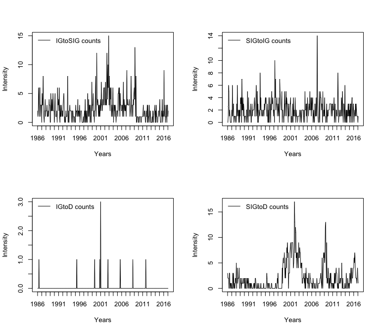
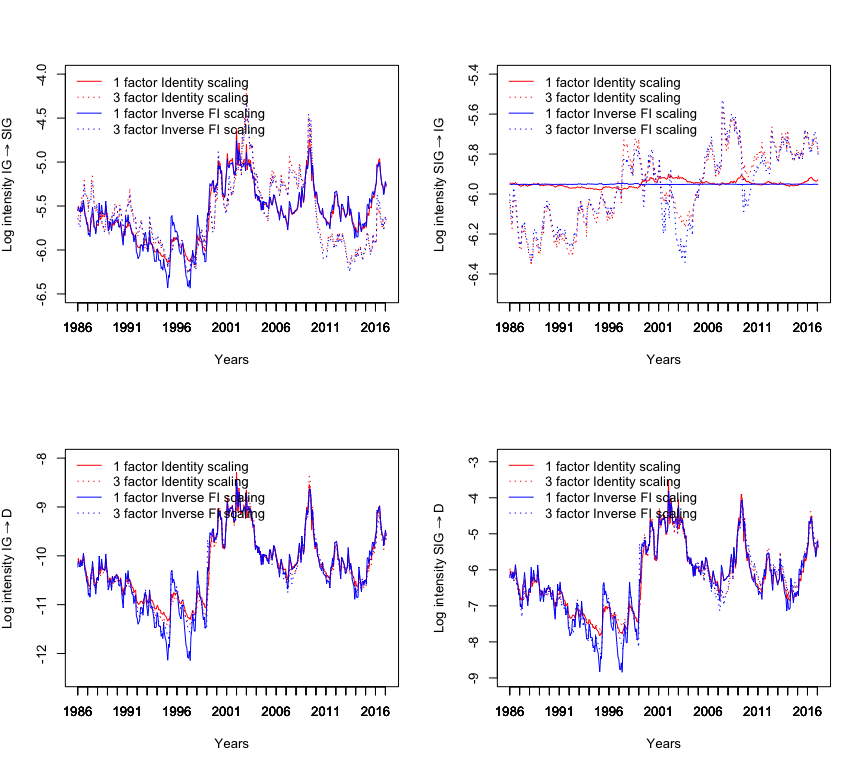
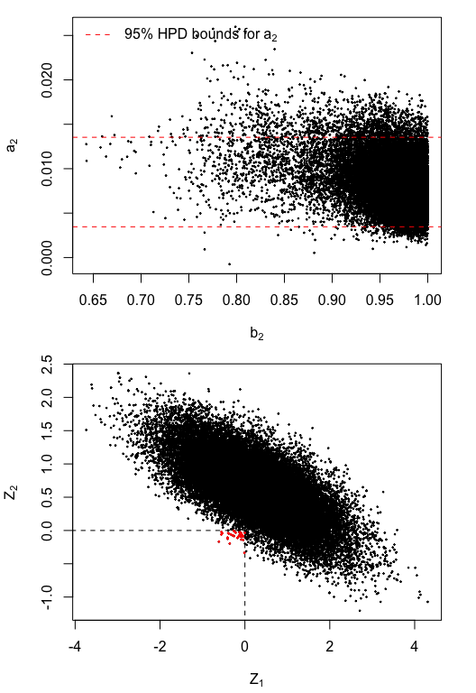
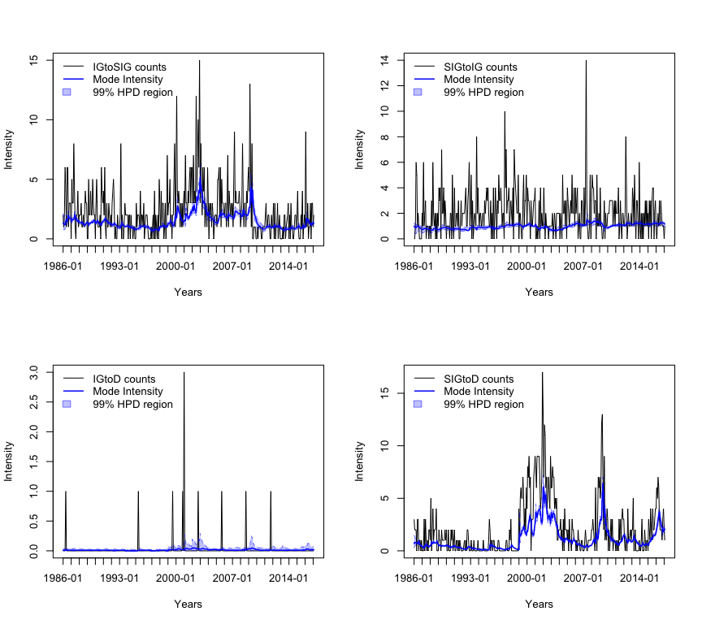

Model Comparisons: Dynamic Pooled Marked Point Process Models
=============================================================

Unfortunately the dataset used in the Dynamic Pooled Marked Point
Process (DPMP) models application of section 4.2 is not public. The
analysis presented here is equivalent but based on simulated data.

    library(BayesianGAS)

    set.seed(100)
    kTransitionTypes <- c("IGtoSIG", "IGtoD", "SIGtoIG", "SIGtoD")
    kScalings <- c(0., -0.5, -1.0)
    kNumFactorSpecs <- c(1, 2, 3)
    kNumParamsVec <- c(9, 10, 12)
    kNumTransitions <- 4

Simulate Data
-------------

The number of firms and the number of events used in simulation is
similar to that of the real data set. Also, events are aggregated per
month to reflect how the real data set is formatted. The DPMP model
chosen for simulation using a 3 factor specification and inverse FI
scaling as these choices seemed to fit the real data set best.

    numInitIG  <- 750
    numInitSIG <- 1000
    numEvents  <- 2500
    numFactors <- 3
    scaling    <- -1.
    simParams <- c(
      A = c(0.055, 0.04, 0.06),
      B = c(0.99, 0.96, 0.98),
      C = c(0.9, 1.1),
      W = c(-5.48, -10.13, -5.46, -5.76)
    )
    dpmpSimModel <- new(DPMP, simParams, numFactors, scaling)
    sims <- dpmpSimModel$Simulate(numInitIG, numInitSIG, numEvents, rep(0, numFactors))
    tauRaw <- as.integer(cumsum(sims[,5]))
    transitionsRaw <- data.frame(sims[,c(1:4)])
    possibleTranstionsRaw <- data.frame(sims[,c(6:9)])
    colnames(possibleTranstionsRaw) <- kTransitionTypes
    colnames(transitionsRaw) <- kTransitionTypes
    transitions <- as.matrix(aggregate(transitionsRaw, by = list(tauRaw), FUN = sum))
    tau <- transitions[, 'Group.1']
    diffTau <- diff(tau)
    transitions <- transitions[-1, kTransitionTypes]
    endTau <- tail(tau, n = 1)
    dates <- seq(as.Date("1986-02-01"), by = "month", length.out = endTau)[tau] - 1
    possibleTranstions <- as.matrix(
      aggregate(possibleTranstionsRaw, by = list(tauRaw), 
                FUN = function(x){tail(x, n = 1)}))[-1, kTransitionTypes]
    y <- cbind(transitions, diffTau, possibleTranstions)

### Plot Transitions

    par(mfcol = c(2, 2))
    for (tt in kTransitionTypes) {
      leg <- paste(tt, "counts")
      plot(dates, transitions[,tt], type = "l", xaxt = "n", xlab = "Years", 
           ylab = "Intensity")
      legend("topleft", legend = leg, bty = "n", lty = 1)
      axis.Date(1, at = seq(min(dates), max(dates), by = "1 years"), format = "%Y")
    }

Transitions

### Set data attributes

    numObs <- dim(y)[1]

Maximum Likelihood (ML) estimation
----------------------------------

Looking at the ML estimates for the DPMP3-Inv model in comparison to the
true parameters used to simulate the data, it is evident that it is
challenging to recover the true parameters of the data generating
process given the limited number of points in time upon which events are
recorded (~400 in this case).

    initParamVecs <- list(
      c(A = 0.01, B = 0.9, C = c(0.5, 0.5, -0.5) , w = c(-5, -10, -5, -5)),
      c(A = rep(0.01, 2), B = rep(0.9, 2), C = rep(0.1, 2) , w = c(-5, -10, -5, -5)),
      c(A = rep(0.01, 3), B = rep(0.9, 3), C = rep(0.1, 2) , w = c(-5, -10, -5, -5))
    )
    parScaleVecs <- list(
      c(A = 0.01, B = 0.01, C = rep(0.05, 3) , w = rep(0.2, 4)),
      c(A = rep(0.01, 2), B = rep(0.02, 2), C = rep(0.05, 2) , w = rep(0.2, 4)),
      c(A = rep(0.01, 3), B = rep(0.01, 3), C = rep(0.05, 2) , w = rep(0.2, 4))
    )
    lowerBoundVecs <- list(
      c(A = -Inf, B = -1, C = rep(-Inf, 3) , w = rep(-Inf, 4)),
      c(A = rep(-Inf, 2), B = rep(-1, 2), C = rep(-Inf, 2), w = rep(-Inf, 4)),
      c(A = rep(-Inf, 3), B = rep(-1, 3), C = rep(-Inf, 2), w = rep(-Inf, 4))
    )
    upperBoundVecs <- list(
      c(A = Inf, B = 0.99, C = rep(Inf, 3) , w = rep(Inf, 4)),
      c(A = rep(Inf, 2), B = rep(0.999, 2), C = rep(Inf, 2), w = rep(Inf, 4)),
      c(A = rep(Inf, 3), B = rep(0.999, 3), C = rep(Inf, 2), w = rep(Inf, 4))
    )
    f1s <- list(0, rep(0, 2), rep(0, 3))
    modelsML <- list()
    for (i in 1:3) {
      numF <- kNumFactorSpecs[i]
      initParams <- initParamVecs[[i]]
      parScales <- parScaleVecs[[i]]
      lb <- lowerBoundVecs[[i]]
      ub <- upperBoundVecs[[i]]
      f1 <- f1s[[i]]
      for (s in kScalings) {
        dpmp <- new(DPMP, numF, s)
        cat("Fitting model: ", dpmp$Name, sprintf("\n"))
        dpmp <- FitML(
          model = dpmp,
          initParams = initParams,
          y = y,
          f1 = f1,
          method = "L-BFGS-B",
          control = list(
            maxit = 1e5, 
            parscale = parScales
          ),
          hessian = TRUE,
          verbose = TRUE,
          lower = lb,
          upper = ub
        )
        modelsML <- c(modelsML, dpmp)
        names(modelsML) <- c(names(modelsML)[1:length(modelsML) - 1], dpmp$Name)
        cat(sprintf("\n"))
      }
    }
    #> Fitting model:  DPMP1-I 
    #> ML Log-Likelihood:  -16012.04 
    #> ML parameter estimates:  0.07800792 0.8903593 -0.9234276 -1.002261 0.05992375 -5.341305 -10.23687 -5.527413 -6.012019 
    #> ML standard errors:  0.01225623 0.02888424 0.1030168 0.7231088 0.06631514 0.1045501 0.3873102 0.03580808 0.1175123 
    #> 
    #> Fitting model:  DPMP1-H 
    #> ML Log-Likelihood:  -16011.32 
    #> ML parameter estimates:  0.06087757 0.8897124 -0.9304355 -1.019384 0.061066 -5.343954 -10.24307 -5.527132 -6.012972 
    #> ML standard errors:  0.007532666 0.02848274 0.1258472 0.7492739 0.06597508 0.1054123 0.3899571 0.03582556 0.1179658 
    #> 
    #> Fitting model:  DPMP1-Inv 
    #> ML Log-Likelihood:  -16010.68 
    #> ML parameter estimates:  0.04770517 0.8893315 -0.9429745 -1.009869 0.06370088 -5.348204 -10.24494 -5.526775 -6.010555 
    #> ML standard errors:  0.004492321 0.02805267 0.130201 0.7682475 0.06548094 0.1062868 0.3904118 0.03585639 0.1173418 
    #> 
    #> Fitting model:  DPMP2-I 
    #> ML Log-Likelihood:  -16002.54 
    #> ML parameter estimates:  0.07798788 0.03982871 0.8904693 0.9045359 -0.9239379 -0.9875473 -5.342473 -10.23622 -5.547287 -6.011219 
    #> ML standard errors:  0.01215528 0.01351375 0.02887492 0.05552003 0.1025215 0.7196208 0.1046226 0.3865432 0.07284257 0.1175461 
    #> 
    #> Fitting model:  DPMP2-H 
    #> ML Log-Likelihood:  -16000.11 
    #> ML parameter estimates:  0.06203968 0.02627513 0.8878032 0.8983234 -0.9180286 -0.8951994 -5.341322 -10.22344 -5.554393 -6.018308 
    #> ML standard errors:  0.007593912 0.008299424 0.02878042 0.0578933 0.1226056 0.7218637 0.1042202 0.3807758 0.07620887 0.118275 
    #> 
    #> Fitting model:  DPMP2-Inv 
    #> ML Log-Likelihood:  -15997.54 
    #> ML parameter estimates:  0.04874671 0.01680146 0.8855488 0.8941308 -0.9376858 -0.9487338 -5.342825 -10.22788 -5.563405 -6.017907 
    #> ML standard errors:  0.004578518 0.004922788 0.02858467 0.05730247 0.1274485 0.7554386 0.1046061 0.3839222 0.08002675 0.116454 
    #> 
    #> Fitting model:  DPMP3-I 
    #> ML Log-Likelihood:  -15958.37 
    #> ML parameter estimates:  0.09671403 0.03986552 0.1190396 0.9201975 0.9042524 0.9187779 0.8079367 -0.1803874 -5.31988 -10.19613 -5.546802 -6.024775 
    #> ML standard errors:  0.009938135 0.01353213 0.010867 0.02641522 0.05582936 0.03643462 0.7178875 0.6988967 0.1529693 0.384418 0.07277218 0.1534734 
    #> 
    #> Fitting model:  DPMP3-H 
    #> ML Log-Likelihood:  -15942.35 
    #> ML parameter estimates:  0.06499473 0.02687022 0.07844504 0.9048629 0.9041927 0.8972046 0.7507939 -0.1373611 -5.308988 -10.17939 -5.554107 -6.05412 
    #> ML standard errors:  0.006840647 0.008177362 0.007975681 0.02647463 0.05321441 0.03597691 0.7159062 0.5526069 0.1373243 0.3770209 0.07938086 0.1650937 
    #> 
    #> Fitting model:  DPMP3-Inv 
    #> ML Log-Likelihood:  -15939.1 
    #> ML parameter estimates:  0.04033205 0.0163228 0.03958714 0.879709 0.9033417 0.8811557 0.789371 -1.532859 -5.287368 -10.41845 -5.569454 -6.035112 
    #> ML standard errors:  0.00437514 0.004643073 0.005229043 0.02877229 0.05177941 0.03544141 0.8791445 0.4322064 0.1121334 0.4603863 0.08288475 0.1552944

MCMC using RWMH
---------------

I deviate slightly here from the analysis presented in the thesis, by
thinning the posterior sample by a factor of 10 (i.e. I keep only 1 out
of 10 draws). This is done to reduce memory usage.

    iter <- 4e5
    thinning <- 10
    numDraws <- floor(iter / thinning)
    warmUpRounds <- c(3, 5, 6)
    priorStacks <- list(
      new(
        PriorStack,
        c("Normal", "TruncatedNormal", rep("Normal", 7)),
        list(
          c(0.05, 1),
          c(0.95, 1, -1, 1),
          c(0.5, 5),
          c(0.5, 5),
          c(-0.5, 5),
          c(-5, 5),
          c(-10, 5),
          c(-5, 5),
          c(-5, 5)
        )
      ),
      new(
        PriorStack,
        c(rep("Normal", 2), rep("TruncatedNormal", 2), rep("Normal", 6)),
        list(
          c(0.05, 1),
          c(0.05, 1),
          c(0.95, 1, -1, 1),
          c(0.95, 1, -1, 1),
          c(0.5, 5),
          c(0.5, 5),
          c(-5, 5),
          c(-10, 5),
          c(-5, 5),
          c(-5, 5)
        )
      ),
      new(
        PriorStack,
        c(rep("Normal", 3), rep("TruncatedNormal", 3), rep("Normal", 6)),
        list(
          c(0.05, 1),
          c(0.05, 1),
          c(0.05, 1),
          c(0.95, 1, -1, 1),
          c(0.95, 1, -1, 1),
          c(0.95, 1, -1, 1),
          c(0.5, 5),
          c(0.5, 5),
          c(-5, 5),
          c(-10, 5),
          c(-5, 5),
          c(-5, 5)
        )
      )
    )

### Run RWMH

    drawsRWMHLst <- list()
    for (i in 1:3) {
      numF <- kNumFactorSpecs[i]
      initParams <- initParamVecs[[i]]
      f1 <- f1s[[i]]
      priorStack <- priorStacks[[i]]
      numParams <- kNumParamsVec[i]
      for (s in kScalings) {
        if ((s  == -1) && (numF > 1)) {
          stepsize1 <- 0.0025
        }else{
          stepsize1 <- 0.006
        }
        dpmp <- new(DPMP, numF, s)
        cat("Running RWMH for model: ", dpmp$Name, sprintf("\n"))
        startTime <- Sys.time()
        cat(sprintf("Warm up 1 \n"))
        warmUpRWMH <- RWMH(
          dpmp$Name,
          priorStack,
          y = y,
          f1 = f1,
          initParams = initParams,
          sigma = diag(numParams),
          iter = 1e4,
          stepsize = 0.006,  # stepsize1,
          printIter = 1e5,
          thinning = thinning
        )
        for (round in 2:max(2, warmUpRounds[i])) {
          cat(sprintf("Warm up %i \n", round))
          warmUpRWMH <- RWMH(
            dpmp$Name,
            priorStack,
            y = y,
            f1 = f1,
            initParams = initParams,
            sigma = cov(warmUpRWMH),
            iter = 2e4,
            stepsize = .2,
            printIter = 1e5,
            thinning = thinning
          )
        }
        drawsRWMH <- RWMH(
          dpmp$Name,
          priorStack,
          y = y,
          f1 = f1,
          initParams = initParams,
          sigma = cov(warmUpRWMH),
          iter = iter,
          stepsize = .4,
          printIter = 1e5,
          thinning = thinning
        )
        endTime <- Sys.time()
        timeRWMH <- difftime(endTime, startTime, units = 'secs')
        cat("RWMH Time: ", timeRWMH, sprintf(" seconds\n"))
        colnames(drawsRWMH) <- names(initParams)
        drawsRWMHLst <- append(drawsRWMHLst, list(drawsRWMH))
        names(drawsRWMHLst) <- 
          c(names(drawsRWMHLst)[1:length(drawsRWMHLst) - 1], dpmp$Name)
        
        ESSs <- coda::effectiveSize(drawsRWMH)
        ESSs <- t(data.frame(ESSs))
        colnames(ESSs) <- names(initParams)
        print(round(ESSs, 1))
        cat(sprintf("\n"))
      }
    }

    #> Running RWMH for model:  DPMP1-I 
    #> Warm up 1 
    #> RWMH - Accept ratio is: 0.611 
    #> Warm up 2 
    #> RWMH - Accept ratio is: 0.508 
    #> Warm up 3 
    #> RWMH - Accept ratio is: 0.666 
    #> iter 100000
    #> iter 200000
    #> iter 300000
    #> RWMH - Accept ratio is: 0.377 
    #> RWMH Time:  39.34667  seconds
    #>         A      B     C1     C2     C3     w1     w2     w3     w4
    #> ESSs 6680 6420.9 7332.9 5687.1 5953.2 5450.2 5822.3 7629.4 5334.9
    #> 
    #> Running RWMH for model:  DPMP1-H 
    #> Warm up 1 
    #> RWMH - Accept ratio is: 0.590 
    #> Warm up 2 
    #> RWMH - Accept ratio is: 0.486 
    #> Warm up 3 
    #> RWMH - Accept ratio is: 0.646 
    #> iter 100000
    #> iter 200000
    #> iter 300000
    #> RWMH - Accept ratio is: 0.385 
    #> RWMH Time:  59.32006  seconds
    #>           A      B   C1     C2     C3     w1     w2     w3     w4
    #> ESSs 6723.4 6112.2 7089 5517.6 7795.2 5816.5 6969.1 8253.3 5602.1
    #> 
    #> Running RWMH for model:  DPMP1-Inv 
    #> Warm up 1 
    #> RWMH - Accept ratio is: 0.511 
    #> Warm up 2 
    #> RWMH - Accept ratio is: 0.465 
    #> Warm up 3 
    #> RWMH - Accept ratio is: 0.617 
    #> iter 100000
    #> iter 200000
    #> iter 300000
    #> RWMH - Accept ratio is: 0.028 
    #> RWMH Time:  61.04918  seconds
    #>          A   B     C1     C2     C3    w1    w2  w3   w4
    #> ESSs 311.5 326 4750.1 1886.7 5007.9 112.4 232.1 483 72.8
    #> 
    #> Running RWMH for model:  DPMP2-I 
    #> Warm up 1 
    #> RWMH - Accept ratio is: 0.564 
    #> Warm up 2 
    #> RWMH - Accept ratio is: 0.463 
    #> Warm up 3 
    #> RWMH - Accept ratio is: 0.513 
    #> Warm up 4 
    #> RWMH - Accept ratio is: 0.598 
    #> Warm up 5 
    #> RWMH - Accept ratio is: 0.169 
    #> iter 100000
    #> iter 200000
    #> iter 300000
    #> RWMH - Accept ratio is: 0.015 
    #> RWMH Time:  41.40671  seconds
    #>      A1    A2    B1    B2   C1   C2    w1  w2    w3    w4
    #> ESSs 75 182.7 176.7 123.8 19.7 19.4 651.4 297 173.7 803.4
    #> 
    #> Running RWMH for model:  DPMP2-H 
    #> Warm up 1 
    #> RWMH - Accept ratio is: 0.469 
    #> Warm up 2 
    #> RWMH - Accept ratio is: 0.470 
    #> Warm up 3 
    #> RWMH - Accept ratio is: 0.635 
    #> Warm up 4 
    #> RWMH - Accept ratio is: 0.562 
    #> Warm up 5 
    #> RWMH - Accept ratio is: 0.607 
    #> iter 100000
    #> iter 200000
    #> iter 300000
    #> RWMH - Accept ratio is: 0.282 
    #> RWMH Time:  86.73755  seconds
    #>          A1     A2     B1     B2   C1     C2   w1     w2     w3     w4
    #> ESSs 4056.5 4534.7 4701.6 4525.1 3818 4227.7 7025 4510.4 3964.8 4693.1
    #> 
    #> Running RWMH for model:  DPMP2-Inv 
    #> Warm up 1 
    #> RWMH - Accept ratio is: 0.328 
    #> Warm up 2 
    #> RWMH - Accept ratio is: 0.451 
    #> Warm up 3 
    #> RWMH - Accept ratio is: 0.660 
    #> Warm up 4 
    #> RWMH - Accept ratio is: 0.590 
    #> Warm up 5 
    #> RWMH - Accept ratio is: 0.624 
    #> iter 100000
    #> iter 200000
    #> iter 300000
    #> RWMH - Accept ratio is: 0.300 
    #> RWMH Time:  73.10573  seconds
    #>          A1     A2   B1     B2     C1   C2     w1     w2   w3     w4
    #> ESSs 5357.1 5093.3 4977 2661.5 4655.3 4685 5459.1 4255.3 4287 6482.9
    #> 
    #> Running RWMH for model:  DPMP3-I 
    #> Warm up 1 
    #> RWMH - Accept ratio is: 0.465 
    #> Warm up 2 
    #> RWMH - Accept ratio is: 0.614 
    #> Warm up 3 
    #> RWMH - Accept ratio is: 0.643 
    #> Warm up 4 
    #> RWMH - Accept ratio is: 0.562 
    #> Warm up 5 
    #> RWMH - Accept ratio is: 0.548 
    #> Warm up 6 
    #> RWMH - Accept ratio is: 0.574 
    #> iter 100000
    #> iter 200000
    #> iter 300000
    #> RWMH - Accept ratio is: 0.347 
    #> RWMH Time:  45.78143  seconds
    #>          A1     A2     A3     B1     B2     B3     C1     C2     w1     w2
    #> ESSs 6159.6 4700.9 6291.6 4722.9 2057.7 4227.2 5026.7 5532.3 4417.3 5329.2
    #>          w3     w4
    #> ESSs 1233.8 3924.9
    #> 
    #> Running RWMH for model:  DPMP3-H 
    #> Warm up 1 
    #> RWMH - Accept ratio is: 0.388 
    #> Warm up 2 
    #> RWMH - Accept ratio is: 0.630 
    #> Warm up 3 
    #> RWMH - Accept ratio is: 0.611 
    #> Warm up 4 
    #> RWMH - Accept ratio is: 0.622 
    #> Warm up 5 
    #> RWMH - Accept ratio is: 0.582 
    #> Warm up 6 
    #> RWMH - Accept ratio is: 0.601 
    #> iter 100000
    #> iter 200000
    #> iter 300000
    #> RWMH - Accept ratio is: 0.345 
    #> RWMH Time:  108.4984  seconds
    #>        A1   A2     A3     B1     B2   B3     C1     C2     w1   w2     w3
    #> ESSs 6709 5532 6045.9 5643.1 3111.5 4699 5749.7 5023.5 5012.5 5331 3330.9
    #>          w4
    #> ESSs 3520.9
    #> 
    #> Running RWMH for model:  DPMP3-Inv 
    #> Warm up 1 
    #> RWMH - Accept ratio is: 0.121 
    #> Warm up 2 
    #> RWMH - Accept ratio is: 0.641 
    #> Warm up 3 
    #> RWMH - Accept ratio is: 0.633 
    #> Warm up 4 
    #> RWMH - Accept ratio is: 0.609 
    #> Warm up 5 
    #> RWMH - Accept ratio is: 0.583 
    #> Warm up 6 
    #> RWMH - Accept ratio is: 0.573 
    #> iter 100000
    #> iter 200000
    #> iter 300000
    #> RWMH - Accept ratio is: 0.340 
    #> RWMH Time:  84.79185  seconds
    #>        A1     A2     A3     B1     B2     B3     C1   C2     w1     w2
    #> ESSs 6086 5150.7 3977.6 4608.4 4592.8 4964.5 4383.2 2711 3744.1 4658.7
    #>          w3     w4
    #> ESSs 5261.6 6178.4

Model comparisons
-----------------

    IC <- function(logl, npar, k = log(npar)){
      IC <- -2 * logl + k * npar
      return(IC)
    }
    modelScores <- data.frame(matrix(
      0, 
      nrow = 9, 
      ncol = 3, 
      dimnames = list(names(modelsML), c("MarginalLikelihood", "LogLikelihood", "BIC"))
    ))
    burn <- 1000

### Compute marginals and Bayesian Information criteria (BICs)

    upperBoundVecs <- list(
      c(A = Inf, B = 1., C = rep(Inf, 3) , w = rep(Inf, 4)),
      c(A = rep(Inf, 2), B = rep(1., 2), C = rep(Inf, 2), w = rep(Inf, 4)),
      c(A = rep(Inf, 3), B = rep(1., 3), C = rep(Inf, 2), w = rep(Inf, 4))
    )
    marginalsLst <- list()
    logLikList <- list()
    for (i in 1:3) {
      numF <- kNumFactorSpecs[i]
      initParams <- initParamVecs[[i]]
      f1 <- f1s[[i]]
      priorStack <- priorStacks[[i]]
      numParams <- kNumParamsVec[i]
      lb <- lowerBoundVecs[[i]]
      ub <- upperBoundVecs[[i]]
      for (s in kScalings) {
        dpmp <- new(DPMP, initParams, priorStack, numF, s)
        logPosterior <- function(pars, data, printErrors = FALSE) {
          out <- tryCatch(
            {dpmp$LogPosteriorWPar(pars, y, f1)},
            error = function(cond) {
              if (printErrors) message(cond)
              return(-Inf)
            }
          )
          return(out)
        }
        cat("Computing marginal for model: ", dpmp$Name, sprintf("\n"))
        marginal <- bridgesampling::bridge_sampler(
          drawsRWMHLst[[dpmp$Name]][-(1:burn), ], 
          log_posterior = logPosterior,
          data = NULL,
          printErrors = FALSE,
          method = "warp3",
          lb = lb,
          ub = ub
        )
        modelScores[dpmp$Name, "MarginalLikelihood"] <- marginal$logml
        modelScores[dpmp$Name, "LogLikelihood"] <- modelsML[[dpmp$Name]]$LogLValML
        modelScores[dpmp$Name, "BIC"] <- IC(modelsML[[dpmp$Name]]$LogLValML, numParams)
      }
    }

<table>
<caption>Marginals, log-likelihoods and BICS</caption>
<thead>
<tr class="header">
<th></th>
<th align="right">MarginalLikelihood</th>
<th align="right">LogLikelihood</th>
<th align="right">BIC</th>
</tr>
</thead>
<tbody>
<tr class="odd">
<td>DPMP1-I</td>
<td align="right">-16046.03</td>
<td align="right">-16012.04</td>
<td align="right">32043.85</td>
</tr>
<tr class="even">
<td>DPMP1-H</td>
<td align="right">-16045.30</td>
<td align="right">-16011.32</td>
<td align="right">32042.42</td>
</tr>
<tr class="odd">
<td>DPMP1-Inv</td>
<td align="right">-16044.80</td>
<td align="right">-16010.68</td>
<td align="right">32041.14</td>
</tr>
<tr class="even">
<td>DPMP2-I</td>
<td align="right">-16113.37</td>
<td align="right">-16002.54</td>
<td align="right">32028.11</td>
</tr>
<tr class="odd">
<td>DPMP2-H</td>
<td align="right">-16035.84</td>
<td align="right">-16000.11</td>
<td align="right">32023.24</td>
</tr>
<tr class="even">
<td>DPMP2-Inv</td>
<td align="right">-16034.00</td>
<td align="right">-15997.54</td>
<td align="right">32018.10</td>
</tr>
<tr class="odd">
<td>DPMP3-I</td>
<td align="right">-15997.15</td>
<td align="right">-15958.37</td>
<td align="right">31946.55</td>
</tr>
<tr class="even">
<td>DPMP3-H</td>
<td align="right">-15982.60</td>
<td align="right">-15942.35</td>
<td align="right">31914.52</td>
</tr>
<tr class="odd">
<td>DPMP3-Inv</td>
<td align="right">-15981.63</td>
<td align="right">-15939.10</td>
<td align="right">31908.01</td>
</tr>
</tbody>
</table>

### Compute Bayes Factors (BFs)

    marginals <- modelScores["MarginalLikelihood"]
    bf1H1I <- bridgesampling::bayes_factor(
      marginals["DPMP1-H", ], marginals["DPMP1-I", ], TRUE)
    bf1Inv1H <- bridgesampling::bayes_factor(
      marginals["DPMP1-Inv", ], marginals["DPMP1-H", ], TRUE)
    bf2H2I <- bridgesampling::bayes_factor(
      marginals["DPMP2-H", ], marginals["DPMP2-I", ], TRUE)
    bf2Inv2H <- bridgesampling::bayes_factor(
      marginals["DPMP2-Inv", ], marginals["DPMP2-H", ], TRUE)
    bf3H3I <- bridgesampling::bayes_factor(
      marginals["DPMP3-H", ], marginals["DPMP3-I", ], TRUE)
    bf3Inv3H <- bridgesampling::bayes_factor(
      marginals["DPMP3-Inv", ], marginals["DPMP3-H", ], TRUE)
    bf2I1I <- bridgesampling::bayes_factor(
      marginals["DPMP2-I", ], marginals["DPMP1-I", ], TRUE)
    bf2H1H <- bridgesampling::bayes_factor(
      marginals["DPMP2-H", ], marginals["DPMP1-H", ], TRUE)
    bf2Inv1Inv <- bridgesampling::bayes_factor(
      marginals["DPMP2-Inv", ], marginals["DPMP1-Inv", ], TRUE)
    bf3I1I <- bridgesampling::bayes_factor(
      marginals["DPMP3-I", ], marginals["DPMP1-I", ], TRUE)
    bf3H1H <- bridgesampling::bayes_factor(
      marginals["DPMP3-H", ], marginals["DPMP1-H", ], TRUE)
    bf3Inv1Inv <- bridgesampling::bayes_factor(
      marginals["DPMP3-Inv", ], marginals["DPMP1-Inv", ], TRUE)

1-H | 1-I : 0.7305773  
1-Inv | 1-H : 0.5028524  
2-H | 2-I : 77.5334889  
2-Inv | 2-H : 1.8433464  
3-H | 3-I : 14.5480301  
3-Inv | 3-H : 0.9659409  
2-I | 1-I : -67.3428938  
2-H | 1-H : 9.4600178  
2-Inv | 1-Inv : 10.8005118  
3-I | 1-I : 48.8861082  
3-H | 1-H : 62.703561  
3-Inv | 1-Inv : 63.1666495

Some Parameter Statistics
-------------------------

    selectedModels <- c("DPMP1-Inv", "DPMP2-Inv", "DPMP3-Inv")
    for (model in selectedModels) {
      summary_ <- summary(coda::mcmc(drawsRWMHLst[[model]]))$statistics
      print(knitr::kable(summary_, caption = model))
    }

<table>
<caption>DPMP1-Inv</caption>
<thead>
<tr class="header">
<th></th>
<th align="right">Mean</th>
<th align="right">SD</th>
<th align="right">Naive SE</th>
<th align="right">Time-series SE</th>
</tr>
</thead>
<tbody>
<tr class="odd">
<td>A</td>
<td align="right">0.0479391</td>
<td align="right">0.0045133</td>
<td align="right">0.0000226</td>
<td align="right">0.0002557</td>
</tr>
<tr class="even">
<td>B</td>
<td align="right">0.8847632</td>
<td align="right">0.0302512</td>
<td align="right">0.0001513</td>
<td align="right">0.0016755</td>
</tr>
<tr class="odd">
<td>C1</td>
<td align="right">-0.9972039</td>
<td align="right">0.1599042</td>
<td align="right">0.0007995</td>
<td align="right">0.0023201</td>
</tr>
<tr class="even">
<td>C2</td>
<td align="right">-1.1596251</td>
<td align="right">0.8188355</td>
<td align="right">0.0040942</td>
<td align="right">0.0188513</td>
</tr>
<tr class="odd">
<td>C3</td>
<td align="right">0.0661924</td>
<td align="right">0.0731054</td>
<td align="right">0.0003655</td>
<td align="right">0.0010330</td>
</tr>
<tr class="even">
<td>w1</td>
<td align="right">-5.3459421</td>
<td align="right">0.1051181</td>
<td align="right">0.0005256</td>
<td align="right">0.0099150</td>
</tr>
<tr class="odd">
<td>w2</td>
<td align="right">-10.3429531</td>
<td align="right">0.4158385</td>
<td align="right">0.0020792</td>
<td align="right">0.0272963</td>
</tr>
<tr class="even">
<td>w3</td>
<td align="right">-5.5280006</td>
<td align="right">0.0368354</td>
<td align="right">0.0001842</td>
<td align="right">0.0016761</td>
</tr>
<tr class="odd">
<td>w4</td>
<td align="right">-6.0060256</td>
<td align="right">0.1119282</td>
<td align="right">0.0005596</td>
<td align="right">0.0131211</td>
</tr>
</tbody>
</table>

<table>
<caption>DPMP2-Inv</caption>
<thead>
<tr class="header">
<th></th>
<th align="right">Mean</th>
<th align="right">SD</th>
<th align="right">Naive SE</th>
<th align="right">Time-series SE</th>
</tr>
</thead>
<tbody>
<tr class="odd">
<td>A1</td>
<td align="right">0.0491370</td>
<td align="right">0.0045846</td>
<td align="right">0.0000229</td>
<td align="right">0.0000626</td>
</tr>
<tr class="even">
<td>A2</td>
<td align="right">0.0187518</td>
<td align="right">0.0048582</td>
<td align="right">0.0000243</td>
<td align="right">0.0000681</td>
</tr>
<tr class="odd">
<td>B1</td>
<td align="right">0.8877407</td>
<td align="right">0.0286969</td>
<td align="right">0.0001435</td>
<td align="right">0.0004068</td>
</tr>
<tr class="even">
<td>B2</td>
<td align="right">0.8522188</td>
<td align="right">0.0894716</td>
<td align="right">0.0004474</td>
<td align="right">0.0017343</td>
</tr>
<tr class="odd">
<td>C1</td>
<td align="right">-0.9745788</td>
<td align="right">0.1386515</td>
<td align="right">0.0006933</td>
<td align="right">0.0020321</td>
</tr>
<tr class="even">
<td>C2</td>
<td align="right">-1.0566249</td>
<td align="right">0.8051546</td>
<td align="right">0.0040258</td>
<td align="right">0.0117632</td>
</tr>
<tr class="odd">
<td>w1</td>
<td align="right">-5.3436306</td>
<td align="right">0.1143559</td>
<td align="right">0.0005718</td>
<td align="right">0.0015477</td>
</tr>
<tr class="even">
<td>w2</td>
<td align="right">-10.3553410</td>
<td align="right">0.4164976</td>
<td align="right">0.0020825</td>
<td align="right">0.0063848</td>
</tr>
<tr class="odd">
<td>w3</td>
<td align="right">-5.5659826</td>
<td align="right">0.0854636</td>
<td align="right">0.0004273</td>
<td align="right">0.0013053</td>
</tr>
<tr class="even">
<td>w4</td>
<td align="right">-6.0142341</td>
<td align="right">0.1236927</td>
<td align="right">0.0006185</td>
<td align="right">0.0015362</td>
</tr>
</tbody>
</table>

<table>
<caption>DPMP3-Inv</caption>
<thead>
<tr class="header">
<th></th>
<th align="right">Mean</th>
<th align="right">SD</th>
<th align="right">Naive SE</th>
<th align="right">Time-series SE</th>
</tr>
</thead>
<tbody>
<tr class="odd">
<td>A1</td>
<td align="right">0.0408374</td>
<td align="right">0.0043283</td>
<td align="right">0.0000216</td>
<td align="right">0.0000555</td>
</tr>
<tr class="even">
<td>A2</td>
<td align="right">0.0182367</td>
<td align="right">0.0047253</td>
<td align="right">0.0000236</td>
<td align="right">0.0000658</td>
</tr>
<tr class="odd">
<td>A3</td>
<td align="right">0.0387973</td>
<td align="right">0.0055132</td>
<td align="right">0.0000276</td>
<td align="right">0.0000874</td>
</tr>
<tr class="even">
<td>B1</td>
<td align="right">0.8794871</td>
<td align="right">0.0300195</td>
<td align="right">0.0001501</td>
<td align="right">0.0004422</td>
</tr>
<tr class="odd">
<td>B2</td>
<td align="right">0.8597437</td>
<td align="right">0.0884497</td>
<td align="right">0.0004422</td>
<td align="right">0.0013051</td>
</tr>
<tr class="even">
<td>B3</td>
<td align="right">0.8798478</td>
<td align="right">0.0373494</td>
<td align="right">0.0001867</td>
<td align="right">0.0005301</td>
</tr>
<tr class="odd">
<td>C1</td>
<td align="right">0.8437632</td>
<td align="right">0.8185692</td>
<td align="right">0.0040928</td>
<td align="right">0.0123640</td>
</tr>
<tr class="even">
<td>C2</td>
<td align="right">-1.5186736</td>
<td align="right">0.5815426</td>
<td align="right">0.0029077</td>
<td align="right">0.0111692</td>
</tr>
<tr class="odd">
<td>w1</td>
<td align="right">-5.2938498</td>
<td align="right">0.1208769</td>
<td align="right">0.0006044</td>
<td align="right">0.0019755</td>
</tr>
<tr class="even">
<td>w2</td>
<td align="right">-10.5212004</td>
<td align="right">0.4944750</td>
<td align="right">0.0024724</td>
<td align="right">0.0072445</td>
</tr>
<tr class="odd">
<td>w3</td>
<td align="right">-5.5735367</td>
<td align="right">0.0884465</td>
<td align="right">0.0004422</td>
<td align="right">0.0012193</td>
</tr>
<tr class="even">
<td>w4</td>
<td align="right">-6.0352208</td>
<td align="right">0.1661441</td>
<td align="right">0.0008307</td>
<td align="right">0.0021137</td>
</tr>
</tbody>
</table>

Plots
-----

### Posterior of intensity

    intensityDraws <- 
      array(0, dim = c(numDraws - burn, numObs, kNumTransitions))
    meanLogIntensitiesLst <- list()
    for (i in c(1, 3)) {
      numF <- kNumFactorSpecs[i]
      f1 <- f1s[[i]]
      for (s in kScalings[c(1,3)]) {
        dpmp <- new(DPMP, numF, s)
        for (i in 1:(numDraws - burn)) {
          dpmp$SetParams(as.vector(drawsRWMHLst[[dpmp$Name]][burn + i,]))
          intensityDraws[i, , ] <- dpmp$IntensityFilter(y, f1, TRUE)
          if ((i > 0) && ((i %% 1e4) == 0)) {
            cat(sprintf("iter %i\n", i));
          }
        }
        meanLogIntensities <- colMeans(intensityDraws)
        colnames(meanLogIntensities) <- kTransitionTypes
        meanLogIntensitiesLst <- 
          append(meanLogIntensitiesLst, list(meanLogIntensities))
        names(meanLogIntensitiesLst) <- c(
          names(meanLogIntensitiesLst)[1:length(meanLogIntensitiesLst) - 1], dpmp$Name)
      }
    }
    #> iter 10000
    #> iter 20000
    #> iter 30000
    #> iter 10000
    #> iter 20000
    #> iter 30000
    #> iter 10000
    #> iter 20000
    #> iter 30000
    #> iter 10000
    #> iter 20000
    #> iter 30000
    intensityDraws <- exp(intensityDraws)

### Mean log intensity plots

    selectedModels <- c("DPMP1-I", "DPMP3-I", "DPMP1-Inv", "DPMP3-Inv")
    labY <- c(
      expression("Log intensity" ~ IG %->% SIG), 
      expression("Log intensity" ~ IG %->% D), 
      expression("Log intensity" ~ SIG %->% IG), 
      expression("Log intensity" ~ SIG %->% D)
    )
    names(labY) <- kTransitionTypes
    legMeans <- c(
      "1 factor Identity scaling",
      "3 factor Identity scaling",
      "1 factor Inverse FI scaling",
      "3 factor Inverse FI scaling"
    )
    names(legMeans) <- selectedModels
    yLims <- list(c(-8, -3.5), c(-14, -7), c(-6.3, -4.5), c(-9, -3.5))
    names(yLims) <- kTransitionTypes
    par(mfcol = c(2, 2))
    for (tt in kTransitionTypes) {
      for (model in selectedModels) {
        if (grepl("3", model)) lty = 3 else lty = 1
        if (grepl("Inv", model)) col = "blue" else col = "red"
        if (model == selectedModels[1]) {
          plot(dates, meanLogIntensitiesLst[[model]][,tt], type = "l", xaxt = "n", 
               xlab = "Years",  ylab = labY[tt], lty = lty, ylim = yLims[[tt]],
               col = col)
        }else{
          lines(dates, meanLogIntensitiesLst[[model]][,tt], lty = lty, col = col)
        }
        axis.Date(1, at = seq(min(dates), max(dates), by = "1 years"), format = "%Y")
      }
      legend("topleft", bty = "n", col = c("red", "red", "blue", "blue"), 
             lty=c(1, 3, 1, 3), legend = legMeans)
    }

Mean Log Intensities

### Joint distribution plots

    selectedDraws <- drawsRWMHLst[["DPMP3-Inv"]][-(1:burn), ]
    par(mfrow = c(2, 1), mar = c(4.2, 4.2, 1, 2))
    plot(
      selectedDraws[, "B2"],
      selectedDraws[, "A2"],
      cex = 0.2,
      cex.axis = 1,
      xlab = expression(b[2]),
      ylab = expression(a[2])
    )
    abline(h = coda::HPDinterval(coda::mcmc(selectedDraws[, "A2"])), col = "red", 
           lty = 2)
    leg <- expression("95% HPD bounds for" ~ a[2])
    legend("topleft", legend = leg, col = "red", lty = 2,  bty = "n")

    ix <- which((selectedDraws[, "C1"] <= 0) & (selectedDraws[, "C2"] <= 0))
    plot(
      selectedDraws[, "C1"],
      selectedDraws[, "C2"],
      cex = 0.2,
      cex.axis = 1,
      xlab = expression(C[1]),
      ylab = expression(C[2])
    )
    lines(c(-5, 0), c(0, 0), lty = 2, lwd = 1)
    lines(c(0, 0), c(-2, 0), lty = 2, lwd = 1)
    points(selectedDraws[, "C1"][ix], selectedDraws[, "C2"][ix], col = "red",
           cex = 0.2, pch = 19)

### Highest Posterior Density (HPD) intensity plots

    par(mfcol = c(2, 2))
    ttIdx <- 0
    for (tt in kTransitionTypes) {
      ttIdx <- ttIdx + 1
      PlotHPDOverTime(
        intensityDraws[, , ttIdx] * max(transitionData$nummonth),
        transitions[, tt],
        dates,
        ylab = "Intensity",
        statStr = "Intensity",
        obsStr = paste(tt, "counts"),
        modeCol = rgb(0,0,1,1), 
        fillCol = rgb(0,0,1,1/4),
        borderCol = rgb(0,0,1,1/2),
        newPlot = FALSE,
        ylim = NULL,
        dateAxisStep = "1 year"
      )
    }

HPD plots

