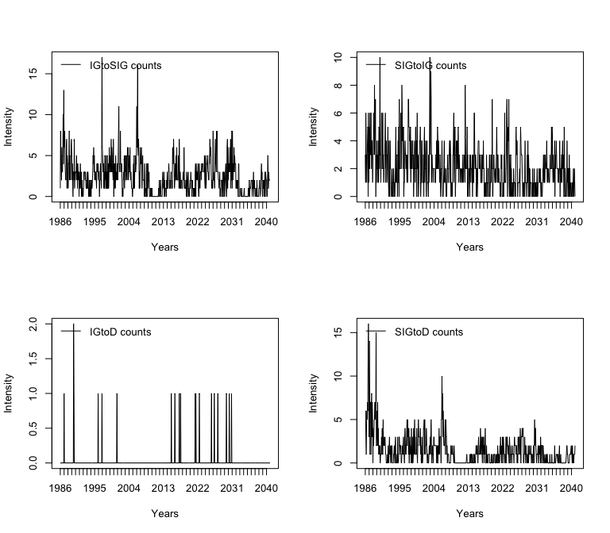
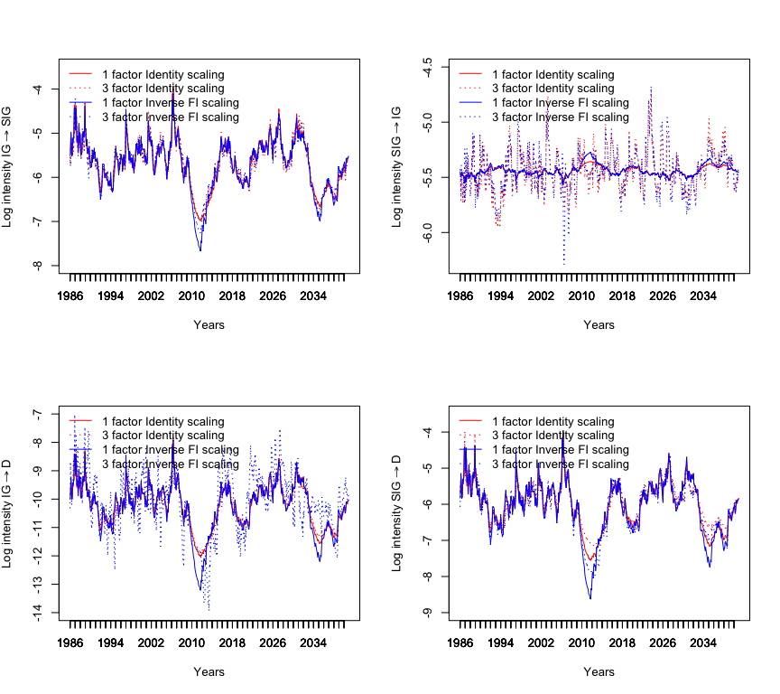
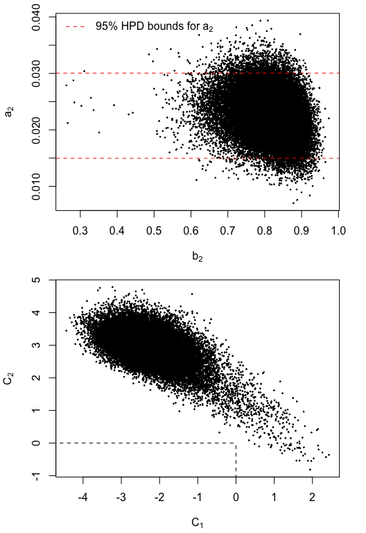
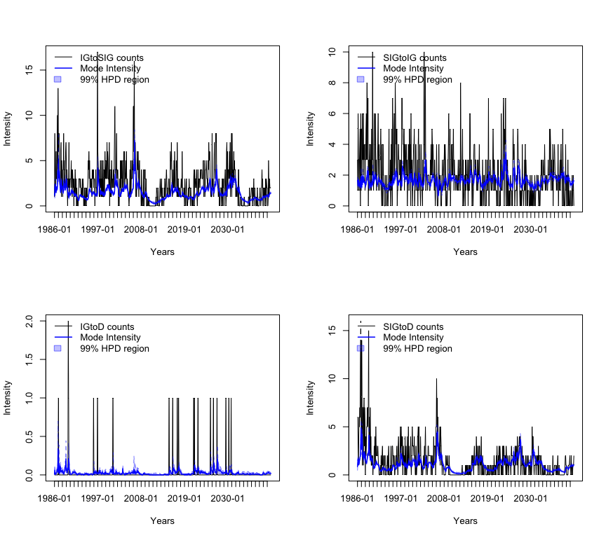

# Model Comparisons: Dynamic Pooled Marked Point Process Models

This document contains the R code to reproduce the plots and statistical analysis presented in section 4.2 of 
> Niesert, R. "Bayesian Inference for Generalized Autoregressive Score Models." (2017).


```r
library(BayesianGAS)
```


```r
set.seed(100)
kTransitionTypes <- c("IGtoSIG", "IGtoD", "SIGtoIG", "SIGtoD")
kScalings <- c(0., -0.5, -1.0)
kNumFactorSpecs <- c(1, 2, 3)
kNumParamsVec <- c(9, 10, 12)
kNumTransitions <- 4
```

## Simulate Data 


```r
simParams <- c(
  A = c(0.07, 0.04),
  B = c(0.99, 0.96),
  C = c(0.9, 1.2),
  W = c(-5.42, -10.07, -5.45, -5.71)
)
dpmpSimModel <- new(DPMP, simParams, 2, -1.)
sims <- dpmpSimModel$Simulate(750, 1000, 4000, rep(0, 2))
tauRaw <- as.integer(cumsum(sims[,5]))
transitionsRaw <- data.frame(sims[,c(1:4)])
possibleTranstionsRaw <- data.frame(sims[,c(6:9)])
colnames(possibleTranstionsRaw) <- kTransitionTypes
colnames(transitionsRaw) <- kTransitionTypes
transitions <- as.matrix(aggregate(transitionsRaw, by = list(tauRaw), FUN = sum))
tau <- transitions[, 'Group.1']
diffTau <- diff(tau)
transitions <- transitions[-1, kTransitionTypes]
endTau <- tail(tau, n = 1)
dates <- seq(as.Date("1986-02-01"), by = "month", length.out = endTau)[tau] - 1
possibleTranstions <- as.matrix(
  aggregate(possibleTranstionsRaw, by = list(tauRaw), 
            FUN = function(x){tail(x, n = 1)}))[-1, kTransitionTypes]
y <- cbind(transitions, diffTau, possibleTranstions)
```

### Plot Transitions

```r
par(mfcol = c(2, 2))
for (tt in kTransitionTypes) {
  leg <- paste(tt, "counts")
  plot(dates, transitions[,tt], type = "l", xaxt = "n", xlab = "Years", 
       ylab = "Intensity")
  legend("topleft", legend = leg, bty = "n", lty = 1)
  axis.Date(1, at = seq(min(dates), max(dates), by = "1 years"), format = "%Y")
}
```

<div class="figure" style="text-align: center">

<p class="caption">Transitions</p>
</div>
### Set data attributes

```r
numObs <- dim(y)[1]
```

## Maximum Likelihood (ML) estimation 


```r
initParamVecs <- list(
  c(A = 0.05, B = 0.95, C = c(0.5, 0.5, -0.5) , w = c(-5, -10, -5, -5)),
  c(A = rep(0.025, 2), B = rep(0.8, 2), C = rep(0.5, 2) , w = c(-5, -10, -5, -5)),
  c(A = rep(0.025, 3), B = rep(0.8, 3), C = rep(0.5, 2) , w = c(-5, -10, -5, -5))
)
parScaleVecs <- list(
  c(A = 0.01, B = 0.01, C = rep(0.05, 3) , w = rep(0.2, 4)),
  c(A = rep(0.01, 2), B = rep(0.02, 2), C = rep(0.05, 2) , w = rep(0.2, 4)),
  c(A = rep(0.01, 3), B = rep(0.01, 3), C = rep(0.05, 2) , w = rep(0.2, 4))
)
lowerBoundVecs <- list(
  c(A = -Inf, B = -1, C = rep(-Inf, 3) , w = rep(-Inf, 4)),
  c(A = rep(-Inf, 2), B = rep(-1, 2), C = rep(-Inf, 2), w = rep(-Inf, 4)),
  c(A = rep(-Inf, 3), B = rep(-1, 3), C = rep(-Inf, 2), w = rep(-Inf, 4))
)
upperBoundVecs <- list(
  c(A = Inf, B = 0.99, C = rep(Inf, 3) , w = rep(Inf, 4)),
  c(A = rep(Inf, 2), B = rep(0.999, 2), C = rep(Inf, 2), w = rep(Inf, 4)),
  c(A = rep(Inf, 3), B = rep(0.999, 3), C = rep(Inf, 2), w = rep(Inf, 4))
)
f1s <- list(0, rep(0, 2), rep(0, 3))
modelsML <- list()
for (i in 1:3) {
  numF <- kNumFactorSpecs[i]
  initParams <- initParamVecs[[i]]
  parScales <- parScaleVecs[[i]]
  lb <- lowerBoundVecs[[i]]
  ub <- upperBoundVecs[[i]]
  f1 <- f1s[[i]]
  for (s in kScalings) {
    dpmp <- new(DPMP, numF, s)
    cat("Fitting model: ", dpmp$Name, sprintf("\n"))
    dpmp <- FitML(
      model = dpmp,
      initParams = initParams,
      y = y,
      f1 = f1,
      method = "L-BFGS-B",
      control = list(
        maxit = 1e5, 
        parscale = parScales
      ),
      hessian = TRUE,
      verbose = TRUE,
      lower = lb,
      upper = ub
    )
    modelsML <- c(modelsML, dpmp)
    names(modelsML) <- c(names(modelsML)[1:length(modelsML) - 1], dpmp$Name)
    cat(sprintf("\n"))
  }
}
#> Fitting model:  DPMP1-I 
#> ML Log-Likelihood:  -25919.93 
#> ML parameter estimates:  0.06978198 0.9794991 0.8397932 1.163307 -0.05687344 -5.418364 -9.820522 -5.460303 -5.703737 
#> ML standard errors:  0.06978198 0.9794991 0.8397932 1.163307 -0.05687344 -5.418364 -9.820522 -5.460303 -5.703737 
#> 
#> Fitting model:  DPMP1-H 
#> ML Log-Likelihood:  -25910.65 
#> ML parameter estimates:  0.0560065 0.9744908 0.8035294 1.138287 -0.06413627 -5.477071 -9.905284 -5.455787 -5.779496 
#> ML standard errors:  0.0560065 0.9744908 0.8035294 1.138287 -0.06413627 -5.477071 -9.905284 -5.455787 -5.779496 
#> 
#> Fitting model:  DPMP1-Inv 
#> ML Log-Likelihood:  -25901.14 
#> ML parameter estimates:  0.04269861 0.9660898 0.7617855 1.089395 -0.0650933 -5.541598 -9.996812 -5.44982 -5.870837 
#> ML standard errors:  0.04269861 0.9660898 0.7617855 1.089395 -0.0650933 -5.541598 -9.996812 -5.44982 -5.870837 
#> 
#> Fitting model:  DPMP2-I 
#> ML Log-Likelihood:  -25894.66 
#> ML parameter estimates:  0.0700188 0.06496276 0.9793394 0.8288143 0.8421205 1.151747 -5.42262 -9.826251 -5.443969 -5.708143 
#> ML standard errors:  0.0700188 0.06496276 0.9793394 0.8288143 0.8421205 1.151747 -5.42262 -9.826251 -5.443969 -5.708143 
#> 
#> Fitting model:  DPMP2-H 
#> ML Log-Likelihood:  -25885.1 
#> ML parameter estimates:  0.05613123 0.03988772 0.9738122 0.8255534 0.8043467 1.133035 -5.485215 -9.914134 -5.433857 -5.787902 
#> ML standard errors:  0.05613123 0.03988772 0.9738122 0.8255534 0.8043467 1.133035 -5.485215 -9.914134 -5.433857 -5.787902 
#> 
#> Fitting model:  DPMP2-Inv 
#> ML Log-Likelihood:  -25877.03 
#> ML parameter estimates:  0.04224906 0.0222066 0.9643971 0.8267049 0.7626812 1.092019 -5.552017 -10.0112 -5.422975 -5.882952 
#> ML standard errors:  0.04224906 0.0222066 0.9643971 0.8267049 0.7626812 1.092019 -5.552017 -10.0112 -5.422975 -5.882952 
#> 
#> Fitting model:  DPMP3-I 
#> ML Log-Likelihood:  -25928.09 
#> ML parameter estimates:  0.08299142 0.06505988 0.09675391 0.9692331 0.8280087 0.9776971 0.3934887 0.9996248 -5.576531 -9.881951 -5.443679 -5.704705 
#> ML standard errors:  0.08299142 0.06505988 0.09675391 0.9692331 0.8280087 0.9776971 0.3934887 0.9996248 -5.576531 -9.881951 -5.443679 -5.704705 
#> 
#> Fitting model:  DPMP3-H 
#> ML Log-Likelihood:  -25918.72 
#> ML parameter estimates:  0.05286237 0.04002062 0.05765335 0.9620029 0.8254356 0.9705968 -1.26626 2.64715 -5.609563 -10.07319 -5.434376 -5.889032 
#> ML standard errors:  0.05286237 0.04002062 0.05765335 0.9620029 0.8254356 0.9705968 -1.26626 2.64715 -5.609563 -10.07319 -5.434376 -5.889032 
#> 
#> Fitting model:  DPMP3-Inv 
#> ML Log-Likelihood:  -25910.34 
#> ML parameter estimates:  0.03269343 0.02242519 0.03106928 0.9555229 0.8270558 0.9580188 -2.448493 2.998678 -5.618027 -10.21824 -5.423592 -6.075943 
#> ML standard errors:  0.03269343 0.02242519 0.03106928 0.9555229 0.8270558 0.9580188 -2.448493 2.998678 -5.618027 -10.21824 -5.423592 -6.075943
```

## MCMC using RWMH

I deviate slightly here from the analysis presented in the thesis, by thinning the posterior sample by a factor of 10 (i.e. I keep only 1 out of 10 draws). This is done to reduce memory usage.


```r
iter <- 4e5
thinning <- 10
numDraws <- floor(iter / thinning)
warmUpRounds <- c(3, 5, 6)
priorStacks <- list(
  new(
    PriorStack,
    c("Normal", "TruncatedNormal", rep("Normal", 7)),
    list(
      c(0.05, 1),
      c(0.95, 1, -1, 1),
      c(0.5, 5),
      c(0.5, 5),
      c(-0.5, 5),
      c(-5, 5),
      c(-10, 5),
      c(-5, 5),
      c(-5, 5)
    )
  ),
  new(
    PriorStack,
    c(rep("Normal", 2), rep("TruncatedNormal", 2), rep("Normal", 6)),
    list(
      c(0.05, 1),
      c(0.05, 1),
      c(0.95, 1, -1, 1),
      c(0.95, 1, -1, 1),
      c(0.5, 5),
      c(0.5, 5),
      c(-5, 5),
      c(-10, 5),
      c(-5, 5),
      c(-5, 5)
    )
  ),
  new(
    PriorStack,
    c(rep("Normal", 3), rep("TruncatedNormal", 3), rep("Normal", 6)),
    list(
      c(0.05, 1),
      c(0.05, 1),
      c(0.05, 1),
      c(0.95, 1, -1, 1),
      c(0.95, 1, -1, 1),
      c(0.95, 1, -1, 1),
      c(0.5, 5),
      c(0.5, 5),
      c(-5, 5),
      c(-10, 5),
      c(-5, 5),
      c(-5, 5)
    )
  )
)
```

### Run RWMH

```r
drawsRWMHLst <- list()
for (i in 1:3) {
  numF <- kNumFactorSpecs[i]
  initParams <- initParamVecs[[i]]
  f1 <- f1s[[i]]
  priorStack <- priorStacks[[i]]
  numParams <- kNumParamsVec[i]
  for (s in kScalings) {
    if ((s  == -1) && (numF > 1)) {
      stepsize1 <- 0.0025
    }else{
      stepsize1 <- 0.006
    }
    dpmp <- new(DPMP, numF, s)
    cat("Running RWMH for model: ", dpmp$Name, sprintf("\n"))
    startTime <- Sys.time()
    cat(sprintf("Warm up 1 \n"))
    warmUpRWMH <- RWMH(
      dpmp$Name,
      priorStack,
      y = y,
      f1 = f1,
      initParams = initParams,
      sigma = diag(numParams),
      iter = 1e4,
      stepsize = 0.006,  # stepsize1,
      printIter = 1e5,
      thinning = thinning
    )
    for (round in 2:max(2, warmUpRounds[i])) {
      cat(sprintf("Warm up %i \n", round))
      warmUpRWMH <- RWMH(
        dpmp$Name,
        priorStack,
        y = y,
        f1 = f1,
        initParams = initParams,
        sigma = cov(warmUpRWMH),
        iter = 2e4,
        stepsize = .2,
        printIter = 1e5,
        thinning = thinning
      )
    }
    drawsRWMH <- RWMH(
      dpmp$Name,
      priorStack,
      y = y,
      f1 = f1,
      initParams = initParams,
      sigma = cov(warmUpRWMH),
      iter = iter,
      stepsize = .4,
      printIter = 1e5,
      thinning = thinning
    )
    endTime <- Sys.time()
    timeRWMH <- difftime(endTime, startTime, units = 'secs')
    cat("RWMH Time: ", timeRWMH, sprintf(" seconds\n"))
    colnames(drawsRWMH) <- names(initParams)
    drawsRWMHLst <- append(drawsRWMHLst, list(drawsRWMH))
    names(drawsRWMHLst) <- 
      c(names(drawsRWMHLst)[1:length(drawsRWMHLst) - 1], dpmp$Name)
    
    ESSs <- coda::effectiveSize(drawsRWMH)
    ESSs <- t(data.frame(ESSs))
    colnames(ESSs) <- names(initParams)
    print(round(ESSs, 1))
    cat(sprintf("\n"))
  }
}
```

```
#> Running RWMH for model:  DPMP1-I 
#> Warm up 1 
#> RWMH - Accept ratio is: 0.352 
#> Warm up 2 
#> RWMH - Accept ratio is: 0.613 
#> Warm up 3 
#> RWMH - Accept ratio is: 0.647 
#> iter 100000
#> iter 200000
#> iter 300000
#> RWMH - Accept ratio is: 0.412 
#> RWMH Time:  86.42216  seconds
#>           A      B     C1     C2     C3   w1   w2     w3     w4
#> ESSs 6589.6 5986.5 6113.3 6702.2 7659.3 5655 5721 6883.2 5880.7
#> 
#> Running RWMH for model:  DPMP1-H 
#> Warm up 1 
#> RWMH - Accept ratio is: 0.380 
#> Warm up 2 
#> RWMH - Accept ratio is: 0.598 
#> Warm up 3 
#> RWMH - Accept ratio is: 0.653 
#> iter 100000
#> iter 200000
#> iter 300000
#> RWMH - Accept ratio is: 0.394 
#> RWMH Time:  125.0815  seconds
#>           A      B   C1     C2     C3     w1     w2     w3   w4
#> ESSs 6920.6 5423.1 6018 5745.6 8633.6 5725.3 5517.8 7926.9 5471
#> 
#> Running RWMH for model:  DPMP1-Inv 
#> Warm up 1 
#> RWMH - Accept ratio is: 0.333 
#> Warm up 2 
#> RWMH - Accept ratio is: 0.594 
#> Warm up 3 
#> RWMH - Accept ratio is: 0.654 
#> iter 100000
#> iter 200000
#> iter 300000
#> RWMH - Accept ratio is: 0.379 
#> RWMH Time:  127.4997  seconds
#>           A      B     C1     C2     C3     w1     w2   w3     w4
#> ESSs 6414.1 5978.4 6686.1 6753.2 7559.3 5502.3 7271.2 7056 5389.4
#> 
#> Running RWMH for model:  DPMP2-I 
#> Warm up 1 
#> RWMH - Accept ratio is: 0.318 
#> Warm up 2 
#> RWMH - Accept ratio is: 0.573 
#> Warm up 3 
#> RWMH - Accept ratio is: 0.576 
#> Warm up 4 
#> RWMH - Accept ratio is: 0.619 
#> Warm up 5 
#> RWMH - Accept ratio is: 0.601 
#> iter 100000
#> iter 200000
#> iter 300000
#> RWMH - Accept ratio is: 0.346 
#> RWMH Time:  92.55852  seconds
#>          A1     A2     B1     B2     C1     C2     w1     w2     w3     w4
#> ESSs 5849.2 5048.3 6441.5 4248.6 5765.4 5616.4 3579.9 4165.8 5332.4 3704.5
#> 
#> Running RWMH for model:  DPMP2-H 
#> Warm up 1 
#> RWMH - Accept ratio is: 0.276 
#> Warm up 2 
#> RWMH - Accept ratio is: 0.581 
#> Warm up 3 
#> RWMH - Accept ratio is: 0.598 
#> Warm up 4 
#> RWMH - Accept ratio is: 0.596 
#> Warm up 5 
#> RWMH - Accept ratio is: 0.617 
#> iter 100000
#> iter 200000
#> iter 300000
#> RWMH - Accept ratio is: 0.353 
#> RWMH Time:  195.4958  seconds
#>          A1     A2     B1     B2     C1     C2     w1     w2   w3     w4
#> ESSs 7502.7 6526.4 8078.4 4766.8 5562.5 5206.9 4473.5 5468.8 6246 4468.5
#> 
#> Running RWMH for model:  DPMP2-Inv 
#> Warm up 1 
#> RWMH - Accept ratio is: 0.214 
#> Warm up 2 
#> RWMH - Accept ratio is: 0.622 
#> Warm up 3 
#> RWMH - Accept ratio is: 0.643 
#> Warm up 4 
#> RWMH - Accept ratio is: 0.615 
#> Warm up 5 
#> RWMH - Accept ratio is: 0.641 
#> iter 100000
#> iter 200000
#> iter 300000
#> RWMH - Accept ratio is: 0.394 
#> RWMH Time:  164.0714  seconds
#>        A1     A2     B1     B2     C1     C2   w1   w2     w3     w4
#> ESSs 5932 7318.4 8363.9 5947.6 6617.5 6473.9 4588 5560 7577.9 4732.1
#> 
#> Running RWMH for model:  DPMP3-I 
#> Warm up 1 
#> RWMH - Accept ratio is: 0.339 
#> Warm up 2 
#> RWMH - Accept ratio is: 0.563 
#> Warm up 3 
#> RWMH - Accept ratio is: 0.583 
#> Warm up 4 
#> RWMH - Accept ratio is: 0.532 
#> Warm up 5 
#> RWMH - Accept ratio is: 0.552 
#> Warm up 6 
#> RWMH - Accept ratio is: 0.519 
#> iter 100000
#> iter 200000
#> iter 300000
#> RWMH - Accept ratio is: 0.327 
#> RWMH Time:  103.773  seconds
#>          A1     A2     A3   B1     B2     B3     C1     C2     w1     w2
#> ESSs 5225.5 5337.6 5711.9 5125 4218.8 2870.1 4588.2 4408.2 3733.5 4246.5
#>          w3   w4
#> ESSs 5252.6 4062
#> 
#> Running RWMH for model:  DPMP3-H 
#> Warm up 1 
#> RWMH - Accept ratio is: 0.231 
#> Warm up 2 
#> RWMH - Accept ratio is: 0.633 
#> Warm up 3 
#> RWMH - Accept ratio is: 0.614 
#> Warm up 4 
#> RWMH - Accept ratio is: 0.543 
#> Warm up 5 
#> RWMH - Accept ratio is: 0.571 
#> Warm up 6 
#> RWMH - Accept ratio is: 0.569 
#> iter 100000
#> iter 200000
#> iter 300000
#> RWMH - Accept ratio is: 0.336 
#> RWMH Time:  242.6236  seconds
#>          A1     A2     A3     B1     B2     B3     C1     C2     w1     w2
#> ESSs 4713.2 5254.2 5247.4 5433.5 4098.5 4554.4 3796.5 3700.1 3498.9 4070.8
#>          w3     w4
#> ESSs 6454.6 3917.5
#> 
#> Running RWMH for model:  DPMP3-Inv 
#> Warm up 1 
#> RWMH - Accept ratio is: 0.104 
#> Warm up 2 
#> RWMH - Accept ratio is: 0.605 
#> Warm up 3 
#> RWMH - Accept ratio is: 0.616 
#> Warm up 4 
#> RWMH - Accept ratio is: 0.535 
#> Warm up 5 
#> RWMH - Accept ratio is: 0.610 
#> Warm up 6 
#> RWMH - Accept ratio is: 0.610 
#> iter 100000
#> iter 200000
#> iter 300000
#> RWMH - Accept ratio is: 0.330 
#> RWMH Time:  189.1757  seconds
#>          A1     A2     A3     B1     B2   B3     C1     C2     w1     w2
#> ESSs 5148.9 5497.1 5608.2 5817.8 7892.7 5636 3456.8 3284.7 4309.2 3563.5
#>          w3     w4
#> ESSs 6564.8 3647.5
```
## Model comparisons


```r
IC <- function(logl, npar, k = log(npar)){
  IC <- -2 * logl + k * npar
  return(IC)
}
modelScores <- data.frame(matrix(
  0, 
  nrow = 9, 
  ncol = 3, 
  dimnames = list(names(modelsML), c("MarginalLikelihood", "LogLikelihood", "BIC"))
))
burn <- 1000
```

### Compute marginals and Bayesian Information criteria (BICs)

```r
upperBoundVecs <- list(
  c(A = Inf, B = 1., C = rep(Inf, 3) , w = rep(Inf, 4)),
  c(A = rep(Inf, 2), B = rep(1., 2), C = rep(Inf, 2), w = rep(Inf, 4)),
  c(A = rep(Inf, 3), B = rep(1., 3), C = rep(Inf, 2), w = rep(Inf, 4))
)
marginalsLst <- list()
logLikList <- list()
for (i in 1:3) {
  numF <- kNumFactorSpecs[i]
  initParams <- initParamVecs[[i]]
  f1 <- f1s[[i]]
  priorStack <- priorStacks[[i]]
  numParams <- kNumParamsVec[i]
  lb <- lowerBoundVecs[[i]]
  ub <- upperBoundVecs[[i]]
  for (s in kScalings) {
    dpmp <- new(DPMP, initParams, priorStack, numF, s)
    logPosterior <- function(pars, data, printErrors = FALSE) {
      out <- tryCatch(
        {dpmp$LogPosteriorLWPar(pars, y, f1)},
        error = function(cond) {
          if (printErrors) message(cond)
          return(-Inf)
        }
      )
      return(out)
    }
    marginal <- bridgesampling::bridge_sampler(
      drawsRWMHLst[[dpmp$Name]][-(1:burn), ], 
      log_posterior = logPosterior,
      data = NULL,
      method = "warp3",
      lb = lb,
      ub = ub
    )
    modelScores[dpmp$Name, "MarginalLikelihood"] <- marginal$logml
    modelScores[dpmp$Name, "LogLikelihood"] <- modelsML[[dpmp$Name]]$LogLValML
    modelScores[dpmp$Name, "BIC"] <- IC(modelsML[[dpmp$Name]]$LogLValML, numParams)
  }
}
#> Warning: 19500 of the 19500 log_prob() evaluations on the warp-transformed
#> posterior draws produced -Inf/Inf.
#> Warning: 19500 of the 19500 log_prob() evaluations on the warp-transformed
#> proposal draws produced -Inf/Inf.
#> Error in out[!from@positive] <- -out[!from@positive]: NAs are not allowed in subscripted assignments
```


Table: Marginals, log-likelihoods and BICS

             MarginalLikelihood   LogLikelihood   BIC
----------  -------------------  --------------  ----
DPMP1-I                       0               0     0
DPMP1-H                       0               0     0
DPMP1-Inv                     0               0     0
DPMP2-I                       0               0     0
DPMP2-H                       0               0     0
DPMP2-Inv                     0               0     0
DPMP3-I                       0               0     0
DPMP3-H                       0               0     0
DPMP3-Inv                     0               0     0

### Compute Bayes Factors (BFs)

```r
marginals <- modelScores["MarginalLikelihood"]
bf1H1I <- bridgesampling::bayes_factor(
  marginals["DPMP1-H", ], marginals["DPMP1-I", ], TRUE)
bf1Inv1H <- bridgesampling::bayes_factor(
  marginals["DPMP1-Inv", ], marginals["DPMP1-H", ], TRUE)
bf2H2I <- bridgesampling::bayes_factor(
  marginals["DPMP2-H", ], marginals["DPMP2-I", ], TRUE)
bf2Inv2H <- bridgesampling::bayes_factor(
  marginals["DPMP2-Inv", ], marginals["DPMP2-H", ], TRUE)
bf3H3I <- bridgesampling::bayes_factor(
  marginals["DPMP3-H", ], marginals["DPMP3-I", ], TRUE)
bf3Inv3H <- bridgesampling::bayes_factor(
  marginals["DPMP3-Inv", ], marginals["DPMP3-H", ], TRUE)
bf2I1I <- bridgesampling::bayes_factor(
  marginals["DPMP2-I", ], marginals["DPMP1-I", ], TRUE)
bf2H1H <- bridgesampling::bayes_factor(
  marginals["DPMP2-H", ], marginals["DPMP1-H", ], TRUE)
bf2Inv1Inv <- bridgesampling::bayes_factor(
  marginals["DPMP2-Inv", ], marginals["DPMP1-Inv", ], TRUE)
bf3I1I <- bridgesampling::bayes_factor(
  marginals["DPMP3-I", ], marginals["DPMP1-I", ], TRUE)
bf3H1H <- bridgesampling::bayes_factor(
  marginals["DPMP3-H", ], marginals["DPMP1-H", ], TRUE)
bf3Inv1Inv <- bridgesampling::bayes_factor(
  marginals["DPMP3-Inv", ], marginals["DPMP1-Inv", ], TRUE)
```

1-H | 1-I : 0  
1-Inv | 1-H : 0  
2-H | 2-I : 0  
2-Inv | 2-H : 0  
3-H | 3-I : 0  
3-Inv | 3-H : 0  
2-I | 1-I : 0  
2-H | 1-H : 0  
2-Inv | 1-Inv : 0  
3-I | 1-I : 0  
3-H | 1-H : 0  
3-Inv | 1-Inv : 0  

## Some Parameter Statistics

```r
selectedModels <- c("DPMP1-Inv", "DPMP2-Inv", "DPMP3-Inv")
for (model in selectedModels) {
  summary_ <- summary(coda::mcmc(drawsRWMHLst[[model]]))$statistics
  print(knitr::kable(summary_, caption = model))
}
```


Table: DPMP1-Inv

             Mean          SD    Naive SE   Time-series SE
---  ------------  ----------  ----------  ---------------
A       0.0430330   0.0029585   0.0000148        0.0000369
B       0.9671581   0.0109687   0.0000548        0.0001419
C1      0.7747781   0.0650553   0.0003253        0.0007956
C2      1.1489383   0.4220020   0.0021100        0.0051352
C3     -0.0655941   0.0337293   0.0001686        0.0003879
w1     -5.5173307   0.1757921   0.0008790        0.0023699
w2    -10.0187005   0.3688743   0.0018444        0.0043259
w3     -5.4529125   0.0331144   0.0001656        0.0003942
w4     -5.8355669   0.2263137   0.0011316        0.0030828


Table: DPMP2-Inv

             Mean          SD    Naive SE   Time-series SE
---  ------------  ----------  ----------  ---------------
A1      0.0425266   0.0029470   0.0000147        0.0000383
A2      0.0225523   0.0037956   0.0000190        0.0000444
B1      0.9655974   0.0108148   0.0000541        0.0001183
B2      0.8082889   0.0642763   0.0003214        0.0008334
C1      0.7713541   0.0650450   0.0003252        0.0007996
C2      1.1312390   0.4253269   0.0021266        0.0052862
w1     -5.5271181   0.1679253   0.0008396        0.0024792
w2    -10.0303252   0.3579169   0.0017896        0.0048000
w3     -5.4238778   0.0484453   0.0002422        0.0005565
w4     -5.8489658   0.2178291   0.0010891        0.0031666


Table: DPMP3-Inv

             Mean          SD    Naive SE   Time-series SE
---  ------------  ----------  ----------  ---------------
A1      0.0326497   0.0030131   0.0000151        0.0000420
A2      0.0226907   0.0038908   0.0000195        0.0000525
A3      0.0309430   0.0030087   0.0000150        0.0000402
B1      0.9561369   0.0123037   0.0000615        0.0001613
B2      0.8127167   0.0618663   0.0003093        0.0006964
B3      0.9590436   0.0125104   0.0000626        0.0001666
C1     -2.2284579   0.6872370   0.0034362        0.0116888
C2      2.9133461   0.4968537   0.0024843        0.0086692
w1     -5.6042844   0.1413287   0.0007066        0.0021530
w2    -10.3206649   0.6810632   0.0034053        0.0114090
w3     -5.4257631   0.0498756   0.0002494        0.0006156
w4     -6.0726281   0.1938843   0.0009694        0.0032103

## Plots

### Posterior of intensity

```r
intensityDraws <- 
  array(0, dim = c(numDraws - burn, numObs, kNumTransitions))
meanLogIntensitiesLst <- list()
for (i in c(1, 3)) {
  numF <- kNumFactorSpecs[i]
  f1 <- f1s[[i]]
  for (s in kScalings[c(1,3)]) {
    dpmp <- new(DPMP, numF, s)
    for (i in 1:(numDraws - burn)) {
      dpmp$SetParams(as.vector(drawsRWMHLst[[dpmp$Name]][burn + i,]))
      intensityDraws[i, , ] <- dpmp$IntensityFilter(y, f1, TRUE)
      if ((i > 0) && ((i %% 1e4) == 0)) {
        cat(sprintf("iter %i\n", i));
      }
    }
    meanLogIntensities <- colMeans(intensityDraws)
    colnames(meanLogIntensities) <- kTransitionTypes
    meanLogIntensitiesLst <- 
      append(meanLogIntensitiesLst, list(meanLogIntensities))
    names(meanLogIntensitiesLst) <- c(
      names(meanLogIntensitiesLst)[1:length(meanLogIntensitiesLst) - 1], dpmp$Name)
  }
}
#> iter 10000
#> iter 20000
#> iter 30000
#> iter 10000
#> iter 20000
#> iter 30000
#> iter 10000
#> iter 20000
#> iter 30000
#> iter 10000
#> iter 20000
#> iter 30000
intensityDraws <- exp(intensityDraws)
```

### Mean log intensity plots

```r
selectedModels <- c("DPMP1-I", "DPMP3-I", "DPMP1-Inv", "DPMP3-Inv")
labY <- c(
  expression("Log intensity" ~ IG %->% SIG), 
  expression("Log intensity" ~ IG %->% D), 
  expression("Log intensity" ~ SIG %->% IG), 
  expression("Log intensity" ~ SIG %->% D)
)
names(labY) <- kTransitionTypes
legMeans <- c(
  "1 factor Identity scaling",
  "3 factor Identity scaling",
  "1 factor Inverse FI scaling",
  "3 factor Inverse FI scaling"
)
names(legMeans) <- selectedModels
yLims <- list(c(-8, -3.5), c(-14, -7), c(-6.3, -4.5), c(-9, -3.5))
names(yLims) <- kTransitionTypes
par(mfcol = c(2, 2))
for (tt in kTransitionTypes) {
  for (model in selectedModels) {
    if (grepl("3", model)) lty = 3 else lty = 1
    if (grepl("Inv", model)) col = "blue" else col = "red"
    if (model == selectedModels[1]) {
      plot(dates, meanLogIntensitiesLst[[model]][,tt], type = "l", xaxt = "n", 
           xlab = "Years",  ylab = labY[tt], lty = lty, ylim = yLims[[tt]],
           col = col)
    }else{
      lines(dates, meanLogIntensitiesLst[[model]][,tt], lty = lty, col = col)
    }
    axis.Date(1, at = seq(min(dates), max(dates), by = "1 years"), format = "%Y")
  }
  legend("topleft", bty = "n", col = c("red", "red", "blue", "blue"), 
         lty=c(1, 3, 1, 3), legend = legMeans)
}
```

<div class="figure" style="text-align: center">

<p class="caption">Mean Log Intensities</p>
</div>


### Joint distribution plots

```r
selectedDraws <- drawsRWMHLst[["DPMP3-Inv"]][-(1:burn), ]
par(mfrow = c(2, 1), mar = c(4.2, 4.2, 1, 2))
plot(
  selectedDraws[, "B2"],
  selectedDraws[, "A2"],
  cex = 0.2,
  cex.axis = 1,
  xlab = expression(b[2]),
  ylab = expression(a[2])
)
abline(h = coda::HPDinterval(coda::mcmc(selectedDraws[, "A2"])), col = "red", 
       lty = 2)
leg <- expression("95% HPD bounds for" ~ a[2])
legend("topleft", legend = leg, col = "red", lty = 2,  bty = "n")

ix <- which((selectedDraws[, "C1"] <= 0) & (selectedDraws[, "C2"] <= 0))
plot(
  selectedDraws[, "C1"],
  selectedDraws[, "C2"],
  cex = 0.2,
  cex.axis = 1,
  xlab = expression(C[1]),
  ylab = expression(C[2])
)
lines(c(-5, 0), c(0, 0), lty = 2, lwd = 1)
lines(c(0, 0), c(-2, 0), lty = 2, lwd = 1)
points(selectedDraws[, "C1"][ix], selectedDraws[, "C2"][ix], col = "red",
       cex = 0.2, pch = 19)
```



### Highest Posterior Density (HPD) intensity plots

```r
par(mfcol = c(2, 2))
ttIdx <- 0
for (tt in kTransitionTypes) {
  ttIdx <- ttIdx + 1
  PlotHPDOverTime(
    intensityDraws[, , ttIdx] * max(transitionData$nummonth),
    transitions[, tt],
    dates,
    ylab = "Intensity",
    statStr = "Intensity",
    obsStr = paste(tt, "counts"),
    modeCol = rgb(0,0,1,1), 
    fillCol = rgb(0,0,1,1/4),
    borderCol = rgb(0,0,1,1/2),
    newPlot = FALSE,
    ylim = NULL,
    dateAxisStep = "1 year"
  )
}
```

<div class="figure" style="text-align: center">

<p class="caption">HPD plots</p>
</div>
